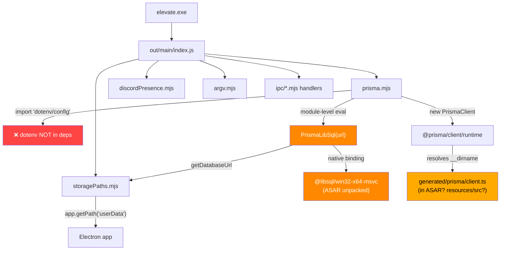

# 🔍 Elevate — Auditoría de Rendimiento al Arrancar (Producción/Unpacked)

**Fecha:** 2026-05-26  
**Objetivo:** Diagnosticar por qué la app `dist/win-unpacked/elevate.exe` se congela al arrancar sin siquiera cargar el renderer, mientras `npm run dev` funciona normalmente.

---

## Resumen Ejecutivo

> [!CAUTION]
> **Tu instinto es correcto: el problema está en el main process antes de `createWindow()`.** Identifiqué **6 hallazgos críticos** y **6 hallazgos importantes** que bloquean o pueden bloquear el arranque en producción. **Prisma es el sospechoso #1**, pero no está solo.

La secuencia de arranque en [index.mjs](file:///c:/Users/Jimbo/Downloads/Music/xc/Elevate/src/main/index.mjs#L760-L806) ejecuta **todo esto ANTES de crear la ventana**:

```
app.whenReady() →
  1. prisma = prismaClient           ← import-time: dotenv/config + PrismaLibSql + PrismaClient
  2. await initializePrisma()        ← 10 sentencias SQL secuenciales (await)
  3. setupMusicHandlers()            ← registra IPC handlers
  4. setup*Handlers() × 7            ← más IPC handlers
  5. void initDiscordPresence()      ← async pero puede fallar silenciosamente
  6. await initializeWatchers()      ← BLOQUEA: queries DB + chokidar.watch()
  7. createTray()                    ← sync: busca icono con existsSync
  8. createWindow()                  ← FINALMENTE crea la ventana
  9. await processAndDispatchLaunchArgs()  ← sync fs.existsSync + statSync por cada argv
```

---

## 🚨 Hallazgos Críticos (Bloquean el arranque)

### CRIT-1: `import 'dotenv/config'` crash silencioso en producción

| | |
|---|---|
| **Archivo** | [prisma.mjs:1](file:///c:/Users/Jimbo/Downloads/Music/xc/Elevate/src/main/prisma.mjs#L1) |
| **Severidad** | 🔴 CRÍTICO |
| **Solo en prod** | ✅ |

```javascript
import 'dotenv/config'  // Línea 1 de prisma.mjs
```

**Problema:** `dotenv` **no está en las dependencias** del `package.json` (ni en `dependencies` ni en `devDependencies`). En desarrollo funciona porque está instalado como dependencia transitiva o porque `electron-vite` lo resuelve. En producción:

1. `electron-vite build` usa `externalizeDepsPlugin()`, que externaliza `dotenv/config`
2. En el ASAR empaquetado, `dotenv` puede no estar disponible → **crash o timeout al hacer `require`**
3. Incluso si se resuelve, `dotenv` intenta leer `.env` desde `process.cwd()` — que en producción es el directorio de instalación, no el de desarrollo. Y `.env` está **excluido del build** por la regla `!{.env,.env.*,...}` en [electron-builder.yml:11](file:///c:/Users/Jimbo/Downloads/Music/xc/Elevate/electron-builder.yml#L11)

> [!WARNING]
> Este import se ejecuta **en module-evaluation time** — antes incluso de que `app.whenReady()` se dispare. Si falla, **todo el main process muere**.

**Fix:**
```javascript
// Eliminar la línea 1 de prisma.mjs:
// import 'dotenv/config'  ← BORRAR

// Ya existe en index.mjs:82-88 un manejo seguro:
// process.loadEnvFile() con try/catch
```

---

### CRIT-2: `PrismaLibSql` adapter se instancia en module-evaluation time

| | |
|---|---|
| **Archivo** | [prisma.mjs:69-71](file:///c:/Users/Jimbo/Downloads/Music/xc/Elevate/src/main/prisma.mjs#L69-L71) |
| **Severidad** | 🔴 CRÍTICO |
| **Solo en prod** | ✅ |

```javascript
const adapter = new PrismaLibSql({
  url: getDatabaseUrl()   // ← Se ejecuta al importar el módulo
})

export const prisma = new PrismaClient({ adapter }).$extends({ ... })
```

**Problema:** Esto se ejecuta **cuando el módulo se importa**, no cuando se llama. La cadena de ejecución:

1. `getDatabaseUrl()` → `getDatabasePath()` → `getStoragePaths()` → `app.getPath('userData')`
2. **`app.getPath('userData')` puede NO estar listo** si el módulo se evalúa antes de `app.whenReady()`
3. `ensureDatabaseFile()` → `copyFileSync(templateDatabase, databasePath)` — copia síncrona de 150KB
4. `PrismaLibSql({ url })` → carga el native binding de `@libsql` → **puede fallar por la ruta en ASAR**
5. `PrismaClient({ adapter })` → inicializa el engine de Prisma

En producción, la ruta del native binding `@libsql/win32-x64-msvc/index.node` está en `app.asar.unpacked/node_modules/@libsql/win32-x64-msvc/index.node`. Si `@prisma/adapter-libsql` construye la ruta relativa al módulo (dentro del ASAR), el `.node` native binding **no se puede leer desde dentro del ASAR** → deadlock o crash.

> [!IMPORTANT]
> Este es probablemente el **blocker principal**. El native addon de `@libsql` necesita resolverse fuera del ASAR, pero el código de resolución del adapter puede estar apuntando dentro.

**Fix:**
```javascript
// Hacer lazy la inicialización de Prisma
let _prisma = null

export function getPrismaClient() {
  if (!_prisma) {
    const adapter = new PrismaLibSql({ url: getDatabaseUrl() })
    _prisma = new PrismaClient({ adapter }).$extends({ /* ... */ })
  }
  return _prisma
}

// O simplemente mover la instanciación dentro de initializePrisma()
```

---

### CRIT-3: Template DB copy síncrona puede colgar con ASAR

| | |
|---|---|
| **Archivo** | [prisma.mjs:28-38](file:///c:/Users/Jimbo/Downloads/Music/xc/Elevate/src/main/prisma.mjs#L28-L38) |
| **Severidad** | 🔴 CRÍTICO (primera ejecución) |
| **Solo en prod** | ✅ (solo en primer arranque post-instalación) |

```javascript
function ensureDatabaseFile(databasePath) {
  if (!databasePath || existsSync(databasePath)) {
    return
  }
  mkdirSync(dirname(databasePath), { recursive: true })
  const templateDatabase = getStoragePaths().templateDatabasePath
  if (templateDatabase) {
    copyFileSync(templateDatabase, databasePath)  // ← 150KB sync copy
  }
}
```

**Problema en producción:**
- `findTemplateDatabasePath()` busca en 4 candidatos usando `existsSync()` — cada uno es una syscall síncrona
- Los candidatos incluyen `process.resourcesPath + '/prisma/template.db'` — que apunta a `resources/prisma/template.db` 
- **Se encontraron `dev.db-shm` y `dev.db-wal` en `dist/win-unpacked/resources/prisma/`** — estos archivos de WAL no deberían estar ahí y pueden causar problemas de lock

> [!WARNING]  
> Archivos encontrados en `dist/win-unpacked/resources/prisma/`:  
> - `dev.db-shm` (32KB) ← **No debería estar aquí**  
> - `dev.db-wal` (64KB) ← **No debería estar aquí**  
> - `template.db` (151KB)  
> - `schema.prisma`  
> 
> El filter en `electron-builder.yml` excluye `dev.db` y `dev.db-journal` pero **NO excluye `dev.db-shm` ni `dev.db-wal`**.

**Fix para electron-builder.yml:**
```yaml
extraResources:
  - from: prisma
    to: prisma
    filter:
      - "**/*"
      - "!dev.db"
      - "!dev.db-journal"
      - "!dev.db-shm"     # ← AGREGAR
      - "!dev.db-wal"     # ← AGREGAR
```

---

### CRIT-4: `initializeWatchers()` bloquea el arranque con queries + chokidar

| | |
|---|---|
| **Archivo** | [index.mjs:796](file:///c:/Users/Jimbo/Downloads/Music/xc/Elevate/src/main/index.mjs#L796) + [directoryWatcher.mjs:104-119](file:///c:/Users/Jimbo/Downloads/Music/xc/Elevate/src/main/utils/directoryWatcher.mjs#L104-L119) |
| **Severidad** | 🔴 CRÍTICO |
| **Solo en prod** | Parcial (peor en prod por paths largos) |

```javascript
// index.mjs:796 — ANTES de createWindow()
await initializeWatchers()

// directoryWatcher.mjs:104-119
export async function initializeWatchers() {
  const directories = await prisma.directory.findMany({  // ← query DB
    where: { parentId: null },
    select: { path: true }
  })
  for (const dir of directories) {
    startWatching(dir.path)  // ← chokidar.watch() para CADA directorio
  }
}
```

**Problema:** Si el usuario tiene 5-10 directorios raíz con miles de archivos, `chokidar.watch()` con `depth: Infinity` va a:
1. Hacer un scan completo de cada directorio
2. Configurar watchers del FS para todos los archivos
3. **Todo esto ANTES de mostrar la ventana**

En producción, los paths suelen ser más largos (ej. `C:\Users\...\Music\`) y los directorios más grandes que en desarrollo.

**Fix:**
```javascript
// Mover DESPUÉS de createWindow() y hacerlo non-blocking
createWindow()

// Fire-and-forget: inicializar watchers en background
initializeWatchers().catch(err => log.error('Watcher init error:', err))
```

---

### CRIT-5: `initializePrisma()` ejecuta 10 queries SQL secuenciales bloqueantes

| | |
|---|---|
| **Archivo** | [prisma.mjs:87-170](file:///c:/Users/Jimbo/Downloads/Music/xc/Elevate/src/main/prisma.mjs#L87-L170) |
| **Severidad** | 🟡 ALTO |
| **Solo en prod** | No, pero peor en prod |

```javascript
export async function initializePrisma() {
  await prisma.$executeRawUnsafe('PRAGMA foreign_keys = ON')
  await prisma.$executeRawUnsafe('PRAGMA journal_mode = WAL')
  await prisma.$executeRawUnsafe('PRAGMA busy_timeout = 5000')
  await prisma.$executeRawUnsafe(`CREATE TABLE IF NOT EXISTS ...`)  // × 5 tablas
  await prisma.$executeRawUnsafe(`CREATE UNIQUE INDEX IF NOT EXISTS ...`)  // × 4 índices
}
```

**Problema:** Son **10 `await` secuenciales** — cada uno espera la respuesta del driver SQLite antes de enviar el siguiente. Deberían ejecutarse en una sola transacción.

**Fix:**
```javascript
export async function initializePrisma() {
  await prisma.$executeRawUnsafe(`
    PRAGMA foreign_keys = ON;
    PRAGMA journal_mode = WAL;
    PRAGMA busy_timeout = 5000;
  `)
  // O mejor: usar una transacción para los CREATE TABLE
  await prisma.$transaction([
    prisma.$executeRawUnsafe(`CREATE TABLE IF NOT EXISTS "VisualizerPresetList" (...)`),
    prisma.$executeRawUnsafe(`CREATE TABLE IF NOT EXISTS "VisualizerSettings" (...)`),
    // etc.
  ])
}
```

---

### CRIT-6: `processAndDispatchLaunchArgs()` con `batchWindowMs: 0` es síncrono-blocking

| | |
|---|---|
| **Archivo** | [index.mjs:801-806](file:///c:/Users/Jimbo/Downloads/Music/xc/Elevate/src/main/index.mjs#L801-L806) |
| **Severidad** | 🟡 ALTO (si argv contiene archivos) |
| **Solo en prod** | ✅ (asociación de archivos, "Open With") |

```javascript
await processAndDispatchLaunchArgs(process.argv.slice(1), {
  mainWindow: mainWin,
  workingDirectory: process.cwd(),
  notifyRenderer: sendNotification,
  batchWindowMs: 0  // ← NO batching, procesa inmediatamente
})
```

Con `batchWindowMs: 0`, si hay argumentos, ejecuta:
- `normalizeLaunchEntries()` → `fs.existsSync()` + `fs.statSync()` por cada argumento
- `processLaunchEntries()` → `getFileInfos()` → queries Prisma + metadata parsing
- Todo **await** antes de que la ventana se muestre

---

## ⚠️ Hallazgos Importantes (Degradan rendimiento)

### IMP-1: Operaciones sync de FS al cargar módulos

| Archivo | Línea | Operación | Contexto |
|---------|-------|-----------|----------|
| [index.mjs](file:///c:/Users/Jimbo/Downloads/Music/xc/Elevate/src/main/index.mjs#L48-L58) | 48-58 | `fs.existsSync()` × 3 | `resolveIconPath()` — se ejecuta en module scope |
| [index.mjs](file:///c:/Users/Jimbo/Downloads/Music/xc/Elevate/src/main/index.mjs#L130) | 130 | `fs.readFileSync()` | `loadWindowState()` — OK, es pequeño |
| [imageSourceHandlers.mjs](file:///c:/Users/Jimbo/Downloads/Music/xc/Elevate/src/main/ipc/imageSourceHandlers.mjs#L11) | 11 | `fs.mkdirSync()` | `ensureBackgroundStorage()` — en module scope |
| [utils.mjs](file:///c:/Users/Jimbo/Downloads/Music/xc/Elevate/src/main/utils/utils.mjs#L10-L16) | 10-16 | `fs.mkdirSync()` × 4 | `getCoverCacheDir()` — lazy pero sync |

**Fix:** Reemplazar `existsSync`/`mkdirSync` en rutas de inicialización con versiones async (`fs.promises.access`, `fs.promises.mkdir`).

---

### IMP-2: `createRequire` + `require('electron')` anti-pattern

| | |
|---|---|
| **Archivos** | [index.mjs:27-29](file:///c:/Users/Jimbo/Downloads/Music/xc/Elevate/src/main/index.mjs#L27-L29), [prisma.mjs:9-10](file:///c:/Users/Jimbo/Downloads/Music/xc/Elevate/src/main/prisma.mjs#L9-L10), [storagePaths.mjs:6-7](file:///c:/Users/Jimbo/Downloads/Music/xc/Elevate/src/main/storagePaths.mjs#L6-L7) |
| **Severidad** | 🟡 MEDIO |

```javascript
const require = createRequire(import.meta.url)
const electron = require('electron')
```

Esto fuerza resolución CJS dentro de ESM — funciona pero es más lento y puede causar problemas de path resolution cuando el archivo está dentro del ASAR. Debería usar `import` directamente:

```javascript
import { app, BrowserWindow, ipcMain } from 'electron'
```

---

### IMP-3: ASAR size excesivo (408MB)

El `app.asar` pesa **408MB**. Esto incluye probablemente:
- `puppeteer` en dependencies (**no se usa en el código del main process** — 0 resultados de grep)
- `react-devtools` en dependencies de producción
- Posiblemente `node_modules` innecesarios

```
app.asar: 408,629,861 bytes (≈ 390MB)
```

> [!WARNING]
> `puppeteer` descarga un Chromium completo (~170MB). Si está empaquetado, contribuye enormemente al tamaño del ASAR y al tiempo de extracción/lectura al arrancar.

---

### IMP-4: `sharp` carga native addon en import time

| | |
|---|---|
| **Archivo** | [utils.mjs:6](file:///c:/Users/Jimbo/Downloads/Music/xc/Elevate/src/main/utils/utils.mjs#L6) |
| **Severidad** | 🟡 MEDIO |

```javascript
import sharp from 'sharp'
```

`sharp` carga su native addon (`.node` file) al importarse. Esto contribuye al startup time pero no debería bloquear. Sin embargo, combinado con ASAR, puede causar resolución lenta.

---

### IMP-5: Prueba de dev files leaking en la distribución

Se encontraron archivos de desarrollo en la distribución:

| Archivo | Ubicación | Problema |
|---------|-----------|----------|
| `dev.db-shm` | `dist/win-unpacked/resources/prisma/` | WAL shared memory — puede causar lock conflict |
| `dev.db-wal` | `dist/win-unpacked/resources/prisma/` | WAL log — puede causar lock conflict |
| `migrations/` | `dist/win-unpacked/resources/prisma/` | Innecesario en producción |

---

### IMP-6: `in-process-gpu` puede aumentar startup time

| | |
|---|---|
| **Archivo** | [index.mjs:97](file:///c:/Users/Jimbo/Downloads/Music/xc/Elevate/src/main/index.mjs#L97) |
| **Severidad** | 🟡 BAJO |

```javascript
app.commandLine.appendSwitch('in-process-gpu')
app.commandLine.appendSwitch('disable-features', 'AudioServiceOutOfProcess')
```

Estas flags se aplican siempre en Windows. `in-process-gpu` obliga al main process a hacer el trabajo de GPU, lo cual puede bloquear si hay problemas de driver.

---

## Secuencia de Arranque — Timeline Estimado

```mermaid
gantt
    title Startup Timeline (Producción — Caso Peor)
    dateFormat X
    axisFormat %Ls

    section Module Eval
    import dotenv/config (FALLA?)     :crit, 0, 500
    PrismaLibSql + PrismaClient init  :crit, 500, 2000
    resolveIconPath (3× existsSync)   :active, 2000, 2100
    nativeImage.createFromPath        :2100, 2200
    createThumbarIcon × 4             :2200, 2300
    process.loadEnvFile (try/catch)   :2300, 2400

    section app.whenReady()
    initializePrisma (10× SQL await)  :crit, 2400, 4000
    setup*Handlers × 9               :4000, 4200
    initDiscordPresence              :4200, 4500
    initializeWatchers (DB + chokidar):crit, 4500, 7000
    createTray                       :7000, 7100
    createWindow                     :milestone, 7100, 7100
    processAndDispatchLaunchArgs     :7100, 8000

    section Renderer
    loadFile/loadURL                  :8000, 9000
    ready-to-show → show()           :9000, 10000
```



---

## 📋 Plan de Corrección (Priorizado)

### Prioridad 1 — Desbloquear arranque (CRIT-1, CRIT-2)

1. **Eliminar `import 'dotenv/config'`** de [prisma.mjs](file:///c:/Users/Jimbo/Downloads/Music/xc/Elevate/src/main/prisma.mjs#L1). Ya se maneja en `index.mjs` con `process.loadEnvFile()`.

2. **Hacer lazy la instanciación de Prisma.** Mover `new PrismaLibSql()` y `new PrismaClient()` dentro de `initializePrisma()` para que se ejecute **después** de `app.whenReady()`.

### Prioridad 2 — Mostrar ventana antes (CRIT-4, CRIT-5, CRIT-6)

3. **Reordenar la secuencia de startup** en `app.whenReady()`:
   ```javascript
   app.whenReady().then(async () => {
     // 1. Crear ventana PRIMERO
     createTray()
     createWindow()
     
     // 2. Inicializar Prisma (sin bloquear UI)
     try {
       await initializePrisma()
     } catch (err) {
       log.error('Prisma init failed:', err)
     }
     
     // 3. Registrar IPC handlers
     setupAllHandlers()
     
     // 4. Fire-and-forget para watchers
     initializeWatchers().catch(err => log.error('Watcher init:', err))
     
     // 5. Fire-and-forget para Discord
     void initDiscordPresence()
     
     // 6. Procesar args en background
     void processAndDispatchLaunchArgs(...)
   })
   ```

4. **Agrupar las queries de `initializePrisma()`** en una sola transacción.

### Prioridad 3 — Limpiar distribución (CRIT-3, IMP-3, IMP-5)

5. **Agregar exclusiones** en `electron-builder.yml`:
   ```yaml
   filter:
     - "**/*"
     - "!dev.db"
     - "!dev.db-journal"
     - "!dev.db-shm"
     - "!dev.db-wal"
     - "!migrations/**"  # No necesario en producción
   ```

6. **Mover `puppeteer` a `devDependencies`** o eliminarlo si no se usa.
7. **Mover `react-devtools` a `devDependencies`**.

### Prioridad 4 — Optimizaciones menores (IMP-1, IMP-2, IMP-4)

8. Reemplazar `createRequire` + `require('electron')` con imports ESM directos.
9. Hacer lazy la carga de `sharp` (importar solo cuando se necesite procesar imágenes).
10. Reemplazar `existsSync`/`mkdirSync` en rutas de inicialización con versiones async.

---

## Diagrama: Flujo de Dependencias al Arrancar



---

## Verificación Recomendada

Para confirmar los hallazgos, ejecuta el unpacked con logging:

```powershell
# Desde PowerShell, ejecuta el unpacked con console output
cd "c:\Users\Jimbo\Downloads\Music\xc\Elevate\dist\win-unpacked"
.\elevate.exe --enable-logging --v=1 2>&1 | Tee-Object -FilePath startup-log.txt
```

O agrega timestamps al código antes de cada paso crítico:

```javascript
app.whenReady().then(async () => {
  console.time('total-startup')
  
  console.time('prisma-init')
  await initializePrisma()
  console.timeEnd('prisma-init')
  
  console.time('handlers')
  setupAllHandlers()
  console.timeEnd('handlers')
  
  console.time('watchers')
  await initializeWatchers()
  console.timeEnd('watchers')
  
  console.time('window')
  createWindow()
  console.timeEnd('window')
  
  console.timeEnd('total-startup')
})
```

---

## Conclusión

| Causa | Impacto | En Dev | En Prod |
|-------|---------|--------|---------|
| `import 'dotenv/config'` sin dep | 💀 Crash/hang | ✅ Funciona (transitivo) | ❌ Falla |
| `PrismaLibSql` en module scope | 💀 Deadlock | ✅ Paths locales | ❌ Paths ASAR |
| `dev.db-shm/wal` en dist | 🔒 DB Lock | N/A | ❌ Conflict |
| `initializeWatchers()` bloqueante | 🐌 2-5s delay | ⚡ Pocos dirs | 🐌 Muchos dirs |
| 10 SQL secuenciales | 🐌 1-2s delay | ⚡ Rápido | 🐌 Cold start |
| `processAndDispatchLaunchArgs` sync | 🐌 Variable | ⚡ Sin args | 🐌 "Open With" |

**La corrección de CRIT-1 y CRIT-2 es la más urgente** — probablemente son la causa directa del congelamiento total en producción.
