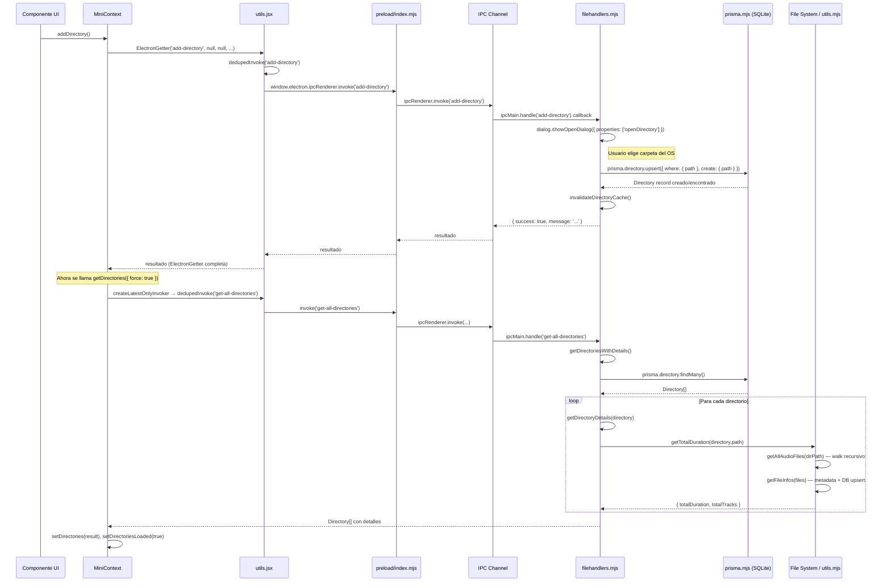

# Flujo Completo: Cargar un Nuevo Directorio en Elevate

Este reporte documenta el flujo end-to-end cuando un usuario agrega un nuevo directorio de música a la aplicación.

---

## Diagrama de Secuencia



---

## 1. Renderer — `MiniContext.jsx`

**Archivo:** [MiniContext.jsx](file:///c:/Users/Jimbo/Downloads/Music/xc/Elevate/src/renderer/src/Contexts/MiniContext.jsx)

### Estado relacionado con directorios

| Variable | Tipo | Propósito |
|---|---|---|
| `directories` | `Array` | Lista de directorios con detalles (totalTracks, totalDuration) |
| `directoriesLoading` | `Boolean` | Flag de carga en progreso |
| `directoriesLoaded` | `Boolean` | Flag indicando si ya se cargaron al menos una vez |
| `directoriesLastLoadedAt` | `Number\|null` | Timestamp de la última carga exitosa |
| `directoriesRequestRef` | `Ref` | Referencia a la Promise pendiente (evita duplicados) |
| `directoriesInvokerRef` | `Ref` | Instancia de `createLatestOnlyInvoker` para deduplicación |

### Función `addDirectory()` — [L116-L119](file:///c:/Users/Jimbo/Downloads/Music/xc/Elevate/src/renderer/src/Contexts/MiniContext.jsx#L116-L119)

```javascript
const addDirectory = async () => {
  await ElectronGetter('add-directory', null, null, 'Directorio agregado!')
  getDirectories({ force: true })
}
```

**Flujo:**
1. Invoca `ElectronGetter` con canal `'add-directory'` y **sin `setState`** (null) — no necesita almacenar el resultado del diálogo.
2. Una vez resuelto (el directorio se guardó en DB), llama a `getDirectories({ force: true })` para refrescar la lista completa.

### Función `getDirectories()` — [L72-L106](file:///c:/Users/Jimbo/Downloads/Music/xc/Elevate/src/renderer/src/Contexts/MiniContext.jsx#L72-L106)

```javascript
const getDirectories = async ({ force = false } = {}) => {
  if (!force && directoriesLoaded) return directories    // Cache hit
  if (directoriesRequestRef.current && !force) return ... // Dedup

  setDirectoriesLoading(true)
  const request = directoriesInvokerRef.current('get-all-directories', ...)
    .then(({ isLatest, result }) => {
      if (isLatest && result) {
        setDirectories(result)
        setDirectoriesLoaded(true)
        setDirectoriesLastLoadedAt(Date.now())
      }
      return result
    })
    ...
}
```

**Mecanismos de protección:**
- **`force: true`** — Ignora el cache y fuerza una nueva petición (usado después de `addDirectory`).
- **`directoriesRequestRef`** — Evita peticiones duplicadas concurrentes.
- **`createLatestOnlyInvoker`** — Solo aplica el resultado de la petición más reciente (evita race conditions).

### Otras funciones de directorio

| Función | Canal IPC | Propósito |
|---|---|---|
| [getDirectoryData](file:///c:/Users/Jimbo/Downloads/Music/xc/Elevate/src/renderer/src/Contexts/MiniContext.jsx#L108-L110) | `'get-directory-by-path'` | Obtiene un directorio específico por path |
| [deleteDirectory](file:///c:/Users/Jimbo/Downloads/Music/xc/Elevate/src/renderer/src/Contexts/MiniContext.jsx#L111-L115) | `'delete-directory'` | Elimina un directorio de la DB y actualiza el state local |
| [getDirFiles](file:///c:/Users/Jimbo/Downloads/Music/xc/Elevate/src/renderer/src/Contexts/MiniContext.jsx#L120-L122) | `'get-audio-in-directory'` | Obtiene los archivos de audio de un directorio |

---

## 2. Utilidades del Renderer — `utils.jsx`

**Archivo:** [utils.jsx](file:///c:/Users/Jimbo/Downloads/Music/xc/Elevate/src/renderer/src/Contexts/utils.jsx)

### `dedupedInvoke(action, ...args)` — [L50-L64](file:///c:/Users/Jimbo/Downloads/Music/xc/Elevate/src/renderer/src/Contexts/utils.jsx#L50-L64)

Deduplicación a nivel global. Usa un `Map` con key `"action:JSON(args)"`. Si ya existe una petición idéntica en vuelo, retorna la misma Promise en vez de crear otra.

```javascript
const pendingInvokes = new Map()

export const dedupedInvoke = async (action, ...args) => {
  const key = getInvokeKey(action, args)
  if (pendingInvokes.has(key)) return pendingInvokes.get(key)

  const promise = window.electron.ipcRenderer.invoke(action, ...args)
    .finally(() => pendingInvokes.delete(key))
  pendingInvokes.set(key, promise)
  return promise
}
```

### `createLatestOnlyInvoker()` — [L66-L80](file:///c:/Users/Jimbo/Downloads/Music/xc/Elevate/src/renderer/src/Contexts/utils.jsx#L66-L80)

Envuelve `dedupedInvoke` con un counter monotónico. Al resolver, retorna `{ isLatest, result }` para que el consumidor pueda descartar resultados de peticiones obsoletas.

### `ElectronGetter(action, setState, value, message)` — [L82-L116](file:///c:/Users/Jimbo/Downloads/Music/xc/Elevate/src/renderer/src/Contexts/utils.jsx#L82-L116)

- Llama `dedupedInvoke(action, value)`
- Si hay resultado y `setState` no es null, llama `setState(result)`
- En error, muestra un toast con `react-toastify`

> [!NOTE]
> En el caso de `addDirectory`, `setState` es `null` — solo interesa que la operación se complete, no su resultado.

---

## 3. Preload Bridge — `preload/index.mjs`

**Archivo:** [index.mjs](file:///c:/Users/Jimbo/Downloads/Music/xc/Elevate/src/preload/index.mjs)

```javascript
const electronAPI = {
  ipcRenderer: {
    invoke: (channel, ...args) => ipcRenderer.invoke(channel, ...args),
    on: (channel, callback) => { ... },
    off: (channel, callback) => { ... },
    removeAllListeners: (channel) => { ... }
  }
}

contextBridge.exposeInMainWorld('electron', electronAPI)
```

**Rol:** Expone un subset seguro de `ipcRenderer` al contexto del renderer via `contextBridge`. El renderer accede a esto como `window.electron.ipcRenderer.invoke(...)`.

**Canales relevantes:** `'add-directory'`, `'get-all-directories'`, `'delete-directory'`, `'get-directory-by-path'`, `'get-audio-in-directory'`

---

## 4. Main Process — `index.mjs`

**Archivo:** [index.mjs](file:///c:/Users/Jimbo/Downloads/Music/xc/Elevate/src/main/index.mjs)

### Inicialización — [L152-L176](file:///c:/Users/Jimbo/Downloads/Music/xc/Elevate/src/main/index.mjs#L152-L176)

```javascript
app.whenReady().then(async () => {
  const prismaModule = await import('./prisma.mjs')
  const [{ setupFilehandlers }, ...] = await Promise.all([
    import('./ipc/filehandlers.mjs'), ...
  ])

  await prismaModule.initializePrisma()

  setupFilehandlers()    // ← Registra handlers de directorio + watchers
  createWindow()
})
```

El orden es importante: Prisma se inicializa **antes** de registrar handlers y crear la ventana.

---

## 5. IPC Handlers — `filehandlers.mjs`

**Archivo:** [filehandlers.mjs](file:///c:/Users/Jimbo/Downloads/Music/xc/Elevate/src/main/ipc/filehandlers.mjs)

### `setupFilehandlers()` — [L262-L464](file:///c:/Users/Jimbo/Downloads/Music/xc/Elevate/src/main/ipc/filehandlers.mjs#L262-L464)

Registra todos los `ipcMain.handle(...)` e inicia `startWatchingDirectories()`.

### Handler `'add-directory'` — [L298-L322](file:///c:/Users/Jimbo/Downloads/Music/xc/Elevate/src/main/ipc/filehandlers.mjs#L298-L322)

```javascript
ipcMain.handle('add-directory', async () => {
  // 1. Abrir diálogo nativo del OS
  const result = await dialog.showOpenDialog({
    properties: ['openDirectory']
  })

  if (result.canceled) return null

  const directoryPath = result.filePaths[0]

  // 2. Upsert en la base de datos
  await prisma.directory.upsert({
    where: { path: directoryPath },
    update: {},
    create: { path: directoryPath }
  })

  // 3. Invalidar todos los caches
  invalidateDirectoryCache()

  return { success: true, message: 'Directory added successfully.' }
})
```

**Pasos clave:**
1. Abre el diálogo nativo de Electron para seleccionar un directorio
2. Usa `upsert` — si el directorio ya existe, no hace nada; si es nuevo, lo crea
3. Invalida **todas** las cachés (directoryDetails, audioPaths, audioCovers)

### Handler `'get-all-directories'` — [L456-L463](file:///c:/Users/Jimbo/Downloads/Music/xc/Elevate/src/main/ipc/filehandlers.mjs#L456-L463)

```javascript
ipcMain.handle('get-all-directories', async () => {
  return await getDirectoriesWithDetails()
})
```

### `getDirectoriesWithDetails()` — [L188-L201](file:///c:/Users/Jimbo/Downloads/Music/xc/Elevate/src/main/ipc/filehandlers.mjs#L188-L201)

```javascript
async function getDirectoriesWithDetails() {
  if (pendingDirectoriesRequest) return pendingDirectoriesRequest  // Dedup server-side

  pendingDirectoriesRequest = prisma.directory.findMany()
    .then(dirs => Promise.all(dirs.map(dir => getDirectoryDetails(dir))))
    .finally(() => { pendingDirectoriesRequest = null })

  return pendingDirectoriesRequest
}
```

- **Deduplicación server-side:** Si ya hay una petición en vuelo, retorna la misma Promise.
- Obtiene todos los registros `Directory` de la DB y enriquece cada uno con detalles.

### `getDirectoryDetails(directory)` — [L166-L186](file:///c:/Users/Jimbo/Downloads/Music/xc/Elevate/src/main/ipc/filehandlers.mjs#L166-L186)

```javascript
async function getDirectoryDetails(directory) {
  const cached = directoryDetailsCache.get(directory.path)
  if (cached && cached.expiresAt > Date.now()) {
    return { ...directory, ...cached.details }
  }

  const details = await getTotalDuration(directory.path)  // ← Costoso
  directoryDetailsCache.set(directory.path, {
    details,
    expiresAt: Date.now() + DIRECTORY_DETAILS_TTL  // 60s
  })

  return { ...directory, ...details }
}
```

- Cachea los detalles por 60 segundos.
- Llama a `getTotalDuration()` que a su vez escanea el sistema de archivos.

### Sistema de caché — [L21-L48](file:///c:/Users/Jimbo/Downloads/Music/xc/Elevate/src/main/ipc/filehandlers.mjs#L21-L48)

| Cache | TTL | Propósito |
|---|---|---|
| `directoryDetailsCache` | 60s | `{ totalDuration, totalTracks }` por directorio |
| `audioPathsCache` | 60s | Lista de paths de archivos de audio por directorio |
| `audioCoverCache` | 10min | Covers de audio (thumb/full), límite 400 entries |
| `pendingDirectoriesRequest` | — | Dedup de la petición `getDirectoriesWithDetails` |

`invalidateDirectoryCache(dirPath?)` — Limpia todas las cachés (o solo las de un directorio específico).

### File Watcher — [L203-L260](file:///c:/Users/Jimbo/Downloads/Music/xc/Elevate/src/main/ipc/filehandlers.mjs#L203-L260)

```javascript
async function startWatchingDirectories() {
  const directories = await prisma.directory.findMany()
  directories.forEach(({ path }) => watchDirectory(path))
}

function watchDirectory(dirPath) {
  if (watchedDirectories.has(dirPath)) return
  fs.watch(dirPath, (eventType, filename) => handleFileChange(...))
  watchedDirectories.add(dirPath)
}
```

> [!IMPORTANT]
> **Problema potencial:** Cuando se agrega un nuevo directorio vía `add-directory`, **no se llama `watchDirectory()` automáticamente** para el nuevo path. El watcher solo se inicia al arrancar la app (`startWatchingDirectories`). Archivos nuevos añadidos al directorio recién agregado no serán detectados en tiempo real hasta el próximo reinicio de la app.

---

## 6. Base de Datos — `prisma.mjs`

**Archivo:** [prisma.mjs](file:///c:/Users/Jimbo/Downloads/Music/xc/Elevate/src/main/prisma.mjs)

### Modelo `Directory` — [schema.prisma](file:///c:/Users/Jimbo/Downloads/Music/xc/Elevate/prisma/schema.prisma#L74-L77)

```prisma
model Directory {
  id   Int    @id @default(autoincrement())
  path String @unique
}
```

Modelo mínimo: solo `id` autoincremental y `path` único. No almacena metadatos del directorio (totalTracks, totalDuration) — esos se calculan dinámicamente.

### Configuración de Prisma

| Característica | Valor |
|---|---|
| **Database** | SQLite (via `@prisma/adapter-libsql`) |
| **Serialización de escrituras** | `serializeWrite()` encola operaciones de escritura secuencialmente |
| **PRAGMAs** | `foreign_keys = ON`, `journal_mode = WAL`, `busy_timeout = 5000` |
| **Ubicación DB (dev)** | `prisma/dev.db` |
| **Ubicación DB (prod)** | `<userData>/elevate.db` o directorio portable |

---

## 7. Utilidades del File System — `utils.mjs`

**Archivo:** [utils.mjs](file:///c:/Users/Jimbo/Downloads/Music/xc/Elevate/src/main/utils/utils.mjs)

### `getAllAudioFiles(dirPath)` — [L42-L68](file:///c:/Users/Jimbo/Downloads/Music/xc/Elevate/src/main/utils/utils.mjs#L42-L68)

Recorre recursivamente el directorio buscando archivos con extensiones `.mp3`, `.wav`, `.flac`. Usa `fs.readdirSync` + `fs.statSync` (síncrono).

### `getTotalDuration(directory)` — [L350-L355](file:///c:/Users/Jimbo/Downloads/Music/xc/Elevate/src/main/utils/utils.mjs#L350-L355)

```javascript
export async function getTotalDuration(directory) {
  const files = getAllAudioFiles(directory)
  const tracks = await getFileInfos(files)
  const totalDuration = tracks.reduce((acc, t) => acc + t.duration, 0)
  return { totalDuration, totalTracks: tracks.length }
}
```

**Operación costosa:** Escanea todos los archivos, parsea metadatos de los nuevos, y suma duraciones.

### `getFileInfos(filePaths)` — [L174-L218](file:///c:/Users/Jimbo/Downloads/Music/xc/Elevate/src/main/utils/utils.mjs#L174-L218)

Para cada archivo:
1. Llama `getOrCreateSong(filePath, fileName)` — Si el song ya existe en DB con `metadataLoaded=true`, retorna el registro directo. Si no, parsea el archivo con `music-metadata`.
2. Obtiene `UserPreferences` (bpm, play_count, is_favorite).
3. Retorna un objeto normalizado sin `picture` (las covers se manejan por separado via `coverHash`).

**Concurrencia:** Usa `mapWithConcurrency` con límite de 6 workers paralelos.

### `getOrCreateSong(filepath, filename)` — [L76-L148](file:///c:/Users/Jimbo/Downloads/Music/xc/Elevate/src/main/utils/utils.mjs#L76-L148)

Es el **corazón de la indexación**:

1. Busca en DB: `prisma.songs.findUnique({ where: { filepath } })`
2. Si existe y `metadataLoaded = true` → retorna inmediatamente (cache hit)
3. Si es nuevo:
   - Parsea metadata con `music-metadata` (title, artist, album, genre, year, duration, size, trackNumber)
   - Si tiene cover art: genera un hash MD5, guarda thumbnails (128px) y full en disco (`<userData>/covers/thumb/` y `covers/full/`)
   - Upsert del song en DB con todos los metadatos
   - Crea `UserPreferences` asociadas

---

## Resumen del Flujo Completo

```
┌─────────────────────────────────────────────────────────────────┐
│  1. UI llama addDirectory()                                     │
│  2. ElectronGetter → dedupedInvoke('add-directory')             │
│  3. Preload bridge → ipcRenderer.invoke(...)                    │
│  4. Main: dialog.showOpenDialog → usuario elige carpeta         │
│  5. Main: prisma.directory.upsert (guarda path en DB)           │
│  6. Main: invalidateDirectoryCache() (limpia todos los caches)  │
│  7. Retorna { success: true }                                   │
│  8. MiniContext: getDirectories({ force: true })                │
│  9. dedupedInvoke('get-all-directories')                        │
│ 10. Main: prisma.directory.findMany()                           │
│ 11. Para cada dir → getTotalDuration()                          │
│     11a. getAllAudioFiles() — walk recursivo del FS              │
│     11b. getFileInfos() — metadata de cada archivo              │
│          → getOrCreateSong() — parse + DB upsert                │
│          → covers guardadas en disco                            │
│ 12. Retorna Directory[] enriquecido al renderer                 │
│ 13. MiniContext actualiza state: setDirectories(result)          │
│ 14. UI se re-renderiza con los nuevos directorios               │
└─────────────────────────────────────────────────────────────────┘
```

> [!WARNING]
> ### Observación: File Watcher no se conecta al nuevo directorio
> En `add-directory`, después del upsert, no se llama a `watchDirectory(newPath)`. Esto significa que los cambios en tiempo real (archivos nuevos, renombrados o eliminados) dentro del directorio recién añadido **no serán detectados** hasta que la app se reinicie y `startWatchingDirectories()` los recoja.
