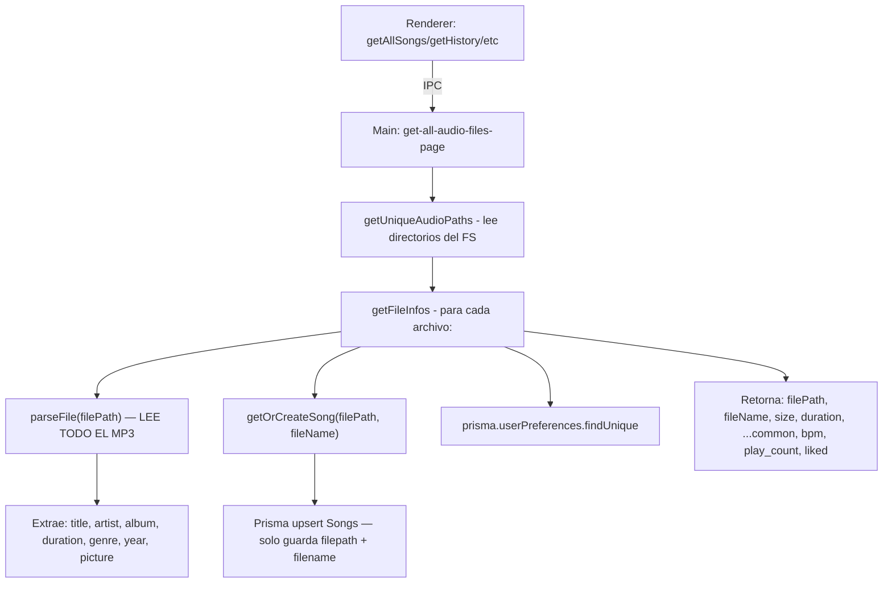
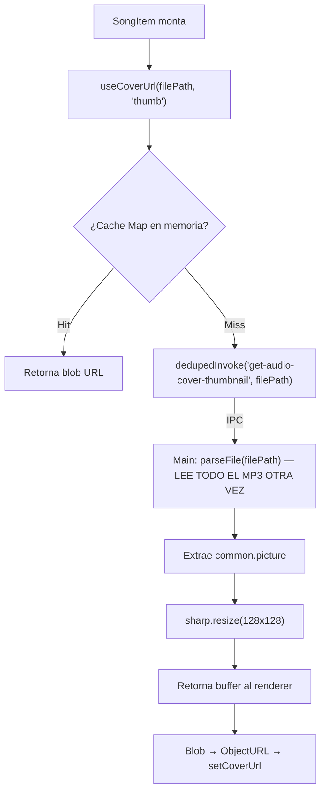
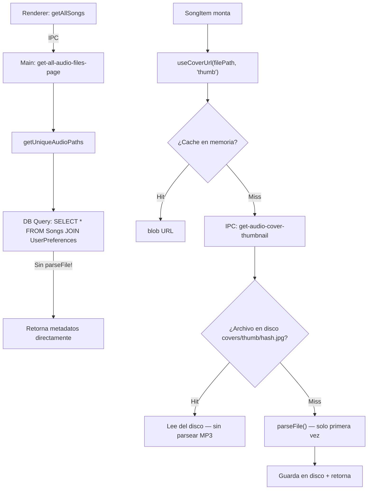

# Elevate — Optimización Profunda

## Resumen del Problema

La app sufre de **3 cuellos de botella críticos** que degradan la experiencia:

1. **Cascada ESM**: 13 páginas cargadas estáticamente → 196 requests en cadena, ~800ms en cascada de red
2. **Parseo repetido de archivos**: Cada `getFileInfos()` ejecuta `parseFile()` de `music-metadata` sobre cada archivo de audio para extraer metadatos que ya se conocen — **el mayor cuello de botella de la app**
3. **IPC masivo de covers**: Cada `SongItem` dispara un IPC individual `get-audio-cover-thumbnail` que lee el archivo MP3 completo para extraer la portada embebida

Además, existe lógica de "retomar sesión" (`LastSong`, `fetchLastData`, `saveLastData`, `handleResume`, `navigateToResume`) que será eliminada para preparar una futura feature.

---

## Análisis del Flujo Actual

### Flujo de Metadatos (HOT PATH — ejecutado en cada carga de lista)



> [!CAUTION]
> **`parseFile()` es la operación más costosa.** Lee el archivo binario completo, decodifica headers ID3/FLAC/etc, extrae portadas embebidas como buffers, parsea todos los tags. Se ejecuta **para cada archivo**, **en cada navegación a una lista**, **cada vez**.

### Flujo de Covers (N+1 IPC Problem)



> [!WARNING]
> Si una lista tiene 100 canciones visibles, se disparan **100 IPCs en paralelo**, cada uno parseando el archivo completo. El cache LRU de `useCoverUrl` mitiga re-renders, pero la primera carga es devastadora.

### Flujo de "Retomar Sesión" (A ELIMINAR)

```
App boot → AudioContext.useEffect → fetchLastData()
  → IPC 'get-last-data' → getLastSong()
    → prisma.lastSong.findFirst(orderBy: id desc)
    → getFileInfo(file) ← OTRO parseFile()
    → retorna { song, index, queueId }
  → handleQueueAndPlay(song, index, queueId, shouldNavigate=false)
    → Si es playlist: IPC 'get-list' → processPlaylist() → parseFile() × N canciones
    → Si es folder: IPC 'get-audio-in-directory' → getFileInfos() → parseFile() × N
    → Navega a la ruta guardada

Cada cambio de canción → saveLastData()
  → IPC 'save-last-data' → prisma.lastSong.create()
  → La tabla LastSong crece infinitamente (solo INSERT, nunca DELETE)
```

---

## Cambios Propuestos

### Fase 1: Esquema Prisma — Guardar metadatos en DB

#### [MODIFY] [schema.prisma](file:///C:/Users/Jimbo/Downloads/Music/xc/Elevate/prisma/schema.prisma)

Extender el modelo `Songs` para almacenar todos los metadatos que actualmente se parsean en cada request:

```diff
 model Songs {
   song_id         Int               @id @default(autoincrement())
   filepath        String            @unique
   filename        String
+  title           String?
+  artist          String?
+  album           String?
+  genre           String?
+  year            Int?
+  duration        Float             @default(0)
+  size            Int               @default(0)
+  trackNumber     Int?
+  coverHash       String?           // hash del cover para invalidación de cache
   UserPreferences UserPreferences[]
   PlayHistory     PlayHistory[]
   timestamp       DateTime          @default(now())
 }
```

**Eliminar el modelo `LastSong`** completamente:

```diff
-model LastSong {
-  id      Int    @id @default(autoincrement())
-  file    String
-  index   Int
-  queueId String
-}
```

---

#### [MODIFY] [utils.mjs](file:///C:/Users/Jimbo/Downloads/Music/xc/Elevate/src/main/ipc/utils/utils.mjs)

- **`getOrCreateSong()`**: Cambiar para que ejecute `parseFile()` **solo en el primer registro** (INSERT). En UPDATEs, retorna la row existente directamente.
- **`getFileInfos()`**: **Ya no parsea archivos**. Lee metadata directamente de la DB. Si una canción no tiene metadata (nuevo archivo), la parsea y guarda. Formato: `SELECT * FROM Songs JOIN UserPreferences`.
- **`extractAudioCover()`**: Guardar el `coverHash` (md5 del buffer) en la DB para saber si el cover cambió.

---

### Fase 2: Cache de Covers en Disco

#### [MODIFY] [filehandlers.mjs](file:///C:/Users/Jimbo/Downloads/Music/xc/Elevate/src/main/ipc/filehandlers.mjs)

- **`getAudioCover()`**: Antes de parsear, verificar si existe un archivo cached en disco (`userData/covers/{hash}.jpg`). Si existe, retornar directamente. Si no, parsear, guardar en disco, retornar.
- Estructura de cache: `{userData}/covers/thumb/{coverHash}.jpg` y `{userData}/covers/full/{coverHash}.jpg`
- El `coverHash` de la DB indica qué archivo de cover usar sin tener que leer el MP3.

---

### Fase 3: Eliminar Lógica de "Retomar Sesión"

#### [MODIFY] [SupeContext.jsx](file:///C:/Users/Jimbo/Downloads/Music/xc/Elevate/src/renderer/src/Contexts/SupeContext.jsx)

Eliminar:
- `fetchLastData()` — función que restaura la última canción al inicio
- `getLastData()` — getter que lee la última canción desde la DB  
- `saveLastData()` — guarda la canción actual en la DB en cada cambio
- `useEffect` en L286-290 que ejecuta `saveLastData` en cada cambio de `currentFile`
- `navigateToResume()` — navega a rutas `/resume`
- `handleResume()` — restaura una cola desde un estado guardado
- Eliminar `fetchLastData`, `handleResume`, `getLastData` del Provider value

#### [MODIFY] [AudioContext.jsx](file:///C:/Users/Jimbo/Downloads/Music/xc/Elevate/src/renderer/src/Contexts/AudioContext.jsx)

Eliminar:
- `useEffect` en L14-20 que llama a `fetchLastData()` al montar
- La importación de `fetchLastData` del destructuring de `useSuper()`

#### [MODIFY] [playlistHandlers.mjs](file:///C:/Users/Jimbo/Downloads/Music/xc/Elevate/src/main/ipc/playlistHandlers.mjs)

Eliminar:
- `saveLastSong()` función (L322-335)
- `getLastSong()` función (L336-355)
- IPC handler `save-last-data` (L574-576)
- IPC handler `get-last-data` (L577-579)

#### [MODIFY] [handleSongClick](file:///C:/Users/Jimbo/Downloads/Music/xc/Elevate/src/renderer/src/Contexts/SupeContext.jsx#L479-L486)

Eliminar la llamada a `saveLastData()` dentro de `handleSongClick`.

#### Páginas con lógica `/resume`:

- [Favourites.jsx](file:///C:/Users/Jimbo/Downloads/Music/xc/Elevate/src/renderer/src/Pages/Favourites/Favourites.jsx) — Eliminar `useEffect` que llama `handleResume` cuando `dir === 'resume'`
- [ListenLater.jsx](file:///C:/Users/Jimbo/Downloads/Music/xc/Elevate/src/renderer/src/Pages/ListenLater/ListenLater.jsx) — Lo mismo

---

### Fase 4: Lazy Loading de Páginas

#### [MODIFY] [App.jsx](file:///C:/Users/Jimbo/Downloads/Music/xc/Elevate/src/renderer/src/App.jsx)

Convertir todos los imports estáticos a `React.lazy()`:

```javascript
import { lazy, Suspense } from 'react'

const Feed = lazy(() => import('./Pages/Feed/Feed'))
const Favourites = lazy(() => import('./Pages/Favourites/Favourites'))
const ListenLater = lazy(() => import('./Pages/ListenLater/ListenLater'))
const AllTracks = lazy(() => import('./Pages/AllTracks/AllTracks'))
const History = lazy(() => import('./Pages/History/History'))
const Playlists = lazy(() => import('./Pages/Playlists/Playlists'))
const Directories = lazy(() => import('./Pages/Directories/Directories'))
const Music = lazy(() => import('./Pages/Music/Music'))
const Search = lazy(() => import('./Pages/Search/Search'))
const PlaylistPage = lazy(() => import('./Pages/PlaylistPage/PlaylistPage'))
const DirPage = lazy(() => import('./Pages/DirPage/DirPage'))
const Settings = lazy(() => import('./Components/Settings/Settings'))
const Lista = lazy(() => import('./Pages/Lista/Lista'))
```

Envolver el `<Outlet>` en `<Suspense>` dentro de `Main.jsx`.

---

### Fase 5: Reset de la Base de Datos

#### [NEW] [reset-db.mjs](file:///C:/Users/Jimbo/Downloads/Music/xc/Elevate/src/main/reset-db.mjs)

Script de migración que:
1. Elimina todas las tablas existentes
2. Regenera el schema con las nuevas columnas
3. Re-indexa todos los archivos de audio de los directorios guardados, parseando metadata una sola vez y almacenándola en la DB

Esto se ejecutará al inicio de la app (una sola vez) detectando que la DB no tiene las nuevas columnas.

---

## Diagrama: Flujo Optimizado



---

## User Review Required

> [!IMPORTANT]
> **Base de datos será reseteada.** Todos los datos actuales (historial, likes, listen later, playlists, play counts) serán eliminados. Esto es necesario porque el schema cambia significativamente y los datos existentes no tienen los campos de metadata que el nuevo schema requiere.

> [!WARNING]
> **La app ya no recordará la última canción reproducida.** El modelo `LastSong` será eliminado y toda la lógica de `fetchLastData/saveLastData/handleResume/navigateToResume` desaparecerá. La app siempre iniciará en blanco (Feed page, sin canción cargada).

## Open Questions

> [!IMPORTANT]
> **¿Quieres preservar los directorios registrados?** Podemos migrar la tabla `Directory` (solo paths) al nuevo schema para no tener que volver a agregar las carpetas de música. O prefieres un reset total de todo.

---

## Verification Plan

### Automated Tests
- `npx prisma db push --force-reset` para aplicar el nuevo schema
- `npx prisma generate` para regenerar el cliente
- Levantar Electron y verificar que la lista de canciones se carga sin errores de consola
- Navegar a History, Favourites, Search — confirmar 0 errores de `@mui/material`
- Verificar que no hay cascada de `parseFile()` en logs del main process después de la primera indexación

### Manual Verification  
- Reproducir "Ace of Spades" — confirmar sin errores de duplicate keys ni crashes
- Cambiar de página varias veces — verificar que los chunks se cargan correctamente (lazy loading)
- Reiniciar la app — confirmar que inicia en Feed sin intentar reproducir nada
