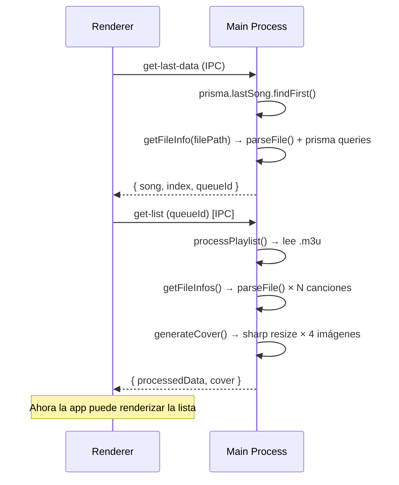

# 🔍 Análisis de rendimiento — Carga inicial de Elevate

## Resumen ejecutivo

| Métrica | Valor | Veredicto |
|---------|-------|-----------|
| **LCP** | 1,803 ms | ⚠️ Aceptable, pero casi todo es *render delay* |
| **CLS** | 0.00 | ✅ Sin saltos de layout |
| **Total de requests** | **196** | 🔴 Excesivo para carga inicial |
| **Cadena crítica más larga** | 8 niveles, **1,784 ms** | 🔴 Cascada de módulos profunda |
| **Forced reflows** | 98 ms en `MediaTimeDisplay` | ⚠️ Ráfagas de layout durante arranque |
| **Lighthouse Best Practices** | 58/100 | 🔴 |
| **Blob URLs (covers)** | ~35 durante la carga | ⚠️ Cada una requiere IPC al main process |

---

## Problema #1: Cascada de módulos ESM — 196 requests en cadena

> [!CAUTION]
> Este es el **problema principal**. Vite en modo dev sirve cada archivo como módulo ESM individual. Tu app tiene **196 requests** en una cascada de hasta **8 niveles de profundidad**.

### Cadena crítica (simplificada)

```
index.html
 └─ main.jsx
     └─ App.jsx
         └─ Main.jsx
             └─ AudioPlayer.jsx
                 └─ Controls.jsx
                     └─ react-icons/tb.js  ← 716 ms desde navegación
                     └─ Controls.scss      ← 682 ms
                 └─ Timer.jsx
                     └─ SliderVolume.jsx
                         └─ SliderVolume.scss  ← 693 ms
```

Cada nivel espera a que el anterior termine de descargarse y evaluarse antes de pedir el siguiente. **8 niveles × ~100ms por nivel = ~800ms** solo en cascada de red.

### ¿Por qué pasa?

Todos los imports en [App.jsx](file:///C:/Users/Jimbo/Downloads/Music/xc/Elevate/src/renderer/src/App.jsx) son **estáticos**:

```javascript
import Favourites from './Pages/Favourites/Favourites'
import ListenLater from './Pages/ListenLater/ListenLater'
import AllTracks from './Pages/AllTracks/AllTracks'
import History from './Pages/History/History'
import Playlists from './Pages/Playlists/Playlists'
import Directories from './Pages/Directories/Directories'
import Feed from './Pages/Feed/Feed'
import Music from './Pages/Music/Music'
import Search from './Pages/Search/Search'
import PlaylistPage from './Pages/PlaylistPage/PlaylistPage'
import DirPage from './Pages/DirPage/DirPage'
import Settings from './Components/Settings/Settings'
import Lista from './Pages/Lista/Lista'
```

**13 páginas** se cargan TODAS al inicio aunque solo una sea visible. Cada página trae sus propios componentes, SCSS, e iconos.

### Solución

```diff
- import Favourites from './Pages/Favourites/Favourites'
- import Feed from './Pages/Feed/Feed'
+ import { lazy, Suspense } from 'react'
+ const Favourites = lazy(() => import('./Pages/Favourites/Favourites'))
+ const Feed = lazy(() => import('./Pages/Feed/Feed'))
  // ... etc para todas las páginas
```

Y envolver las rutas con `<Suspense>`:
```jsx
<Route index element={<Suspense fallback={<Loading />}><Feed /></Suspense>} />
```

> **Impacto estimado**: Reducción de ~100 requests en la carga inicial (solo se cargaría la ruta activa).

---

## Problema #2: Bibliotecas de iconos completas cargadas

> [!WARNING]
> Se importan **8 paquetes de iconos diferentes** de `react-icons`, cada uno como un módulo completo.

Desde la traza de red:

| Paquete | Request |
|---------|---------|
| `react-icons/fa` | Cargado desde Favourites |
| `react-icons/bi` | Cargado desde Favourites |
| `react-icons/md` | Cargado desde Directories |
| `react-icons/pi` | Cargado desde Header |
| `react-icons/io5` | Cargado desde Header |
| `react-icons/lu` | Cargado desde Header |
| `react-icons/tfi` | Cargado desde Header |
| `react-icons/bs` | Cargado desde Header |
| `react-icons/fa6` | Cargado desde Header |
| `react-icons/tb` | Cargado desde Controls |
| `react-icons/go` | Cargado desde DirPage |
| `react-icons/hi` | Cargado desde DropMenu |

Cada paquete de react-icons puede incluir **cientos de iconos** aunque solo uses 1-2. Vite es inteligente con tree-shaking, pero en dev mode cada sub-paquete es un módulo individual con sus propias dependencias.

### Solución
Unificar a 1-2 familias de iconos o usar imports específicos que Vite pueda optimizar mejor. El lazy loading de páginas (Problema #1) resolvería la mayor parte.

---

## Problema #3: `fetchLastData` → cascada IPC bloqueante al arrancar

> [!IMPORTANT]
> Al montar `AudioProvider`, se ejecuta una cadena de IPC síncrona que **bloquea la interactividad** de la app.

### Flujo de arranque



### ¿Dónde está el cuello de botella?

En [playlistHandlers.mjs:336-355](file:///C:/Users/Jimbo/Downloads/Music/xc/Elevate/src/main/ipc/playlistHandlers.mjs#L336-L355), `getLastSong()` llama a `getFileInfo()` que:

1. Lee el archivo del disco con `fs.statSync` (síncrono!)
2. Parsea metadatos con `music-metadata`
3. Hace `upsert` en Prisma
4. Busca `userPreferences` en Prisma

Después, `handleQueueAndPlay` invoca `get-list` que hace [processPlaylist](file:///C:/Users/Jimbo/Downloads/Music/xc/Elevate/src/main/ipc/utils/utils.mjs#L355-L365):

1. Lee el archivo `.m3u` del disco
2. Para **cada canción** en la playlist → `getFileInfos()` con concurrencia 6
3. Cada invocación de `getFileInfos` hace `parseFile` + 2 queries Prisma por canción
4. Genera un collage de covers con `sharp`

**Para una playlist de 30 canciones**: ~30 lecturas de disco + ~30 parseFile + ~60 queries Prisma + 4 operaciones sharp.

### Solución

```diff
  const getLastSong = async () => {
    const lastSong = await prisma.lastSong.findFirst({ orderBy: { id: 'desc' } })
    if (lastSong) {
-     const song = await getFileInfo(lastSong.file)  // Lee disco + parsea
-     return { song, index: lastSong.index, queueId: lastSong.queueId }
+     // Guardar los metadatos junto con lastSong para no tener que releer
+     return { song: lastSong.cachedMetadata, index: lastSong.index, queueId: lastSong.queueId }
    }
  }
```

Y cachear los metadatos en la base de datos al guardar `lastSong`, en vez de re-parsear el archivo cada vez.

---

## Problema #4: Cada `SongItem` dispara un IPC individual para el cover

> [!WARNING]
> Cada `SongItem` llama a `useCoverUrl(file.filePath, 'thumb')` que invoca `get-audio-cover-thumbnail` via IPC.

En [SongItem.jsx:38](file:///C:/Users/Jimbo/Downloads/Music/xc/Elevate/src/renderer/src/Components/SongItem/SongItem.jsx#L38):
```javascript
const mycover = useCoverUrl(file.filePath, 'thumb')
```

Para una lista de 30 canciones visibles, esto genera **30 llamadas IPC paralelas** al main process, cada una:
1. Parsea el archivo de audio completo con `music-metadata`
2. Extrae el cover embebido
3. Lo redimensiona con `sharp` a 128×128

Esto explica los **~35 blob URLs** que aparecen en la cascada de red.

### Solución

Crear un endpoint batch: `get-audio-covers-batch` que reciba un array de filePaths y devuelva todos los covers en una sola ida/vuelta IPC:

```javascript
ipcMain.handle('get-audio-covers-batch', async (event, filePaths) => {
  const results = await mapWithConcurrency(filePaths, 6, async (fp) => {
    const cover = await getAudioCover(fp, 'thumb')
    return { filePath: fp, cover }
  })
  return results
})
```

---

## Problema #5: Forced Reflow en `MediaTimeDisplay`

> [!NOTE]
> La traza detectó **98ms de forced reflows** en la función `draw` de `MediaTimeDisplay.jsx`.

En [MediaTimeDisplay.jsx:97](file:///C:/Users/Jimbo/Downloads/Music/xc/Elevate/src/renderer/src/components/MediaTimeDisplay/MediaTimeDisplay.jsx#L97):

```javascript
const draw = () => {
  const rect = canvas.getBoundingClientRect()  // ← Fuerza layout!
  // ...
}
```

`getBoundingClientRect()` dentro de un `requestAnimationFrame` fuerza al browser a calcular el layout antes de poder continuar. Esto se llama un **forced synchronous layout**.

### Solución

Cachear las dimensiones y solo recalcular cuando la ventana cambie de tamaño:

```javascript
const dimensionsRef = useRef({ width: 0, height: 0 })

useEffect(() => {
  const updateDimensions = () => {
    const rect = canvasRef.current?.getBoundingClientRect()
    if (rect) {
      dimensionsRef.current = {
        width: Math.floor(rect.width * (window.devicePixelRatio || 1)),
        height: Math.floor(rect.height * (window.devicePixelRatio || 1))
      }
    }
  }
  updateDimensions()
  window.addEventListener('resize', updateDimensions)
  return () => window.removeEventListener('resize', updateDimensions)
}, [])

// En draw():
const { width, height } = dimensionsRef.current
```

---

## Resumen de prioridades

| # | Problema | Severidad | Esfuerzo | Impacto |
|---|----------|-----------|----------|---------|
| 1 | Lazy loading de rutas | 🔴 Alto | 🟢 Bajo | ~50% menos requests |
| 3 | Cachear metadatos de lastSong | 🔴 Alto | 🟡 Medio | Elimina cascada IPC al arrancar |
| 4 | Batch de covers | 🟠 Medio | 🟡 Medio | ~30 menos IPCs por lista |
| 2 | Reducir paquetes de iconos | 🟡 Bajo | 🟢 Bajo | Menor peso de módulos |
| 5 | Cachear dimensiones canvas | 🟡 Bajo | 🟢 Bajo | -98ms reflow |

> [!TIP]
> **El fix #1 (lazy loading) es el de mayor impacto con menor esfuerzo.** Solo requiere cambiar los imports en `App.jsx` y envolver rutas con `Suspense`. Reducirías de ~196 a ~60-80 requests en la carga inicial.
