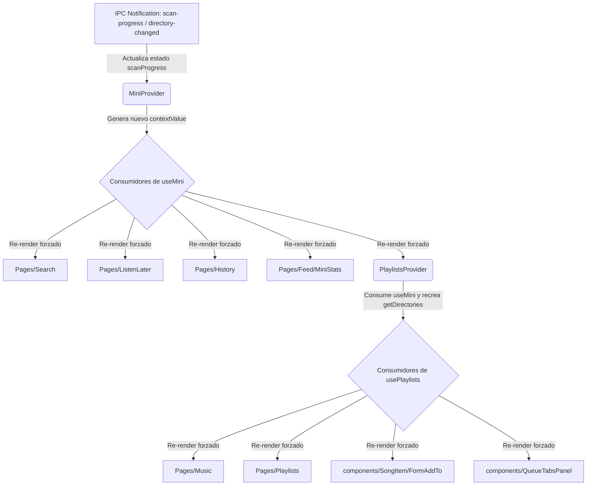
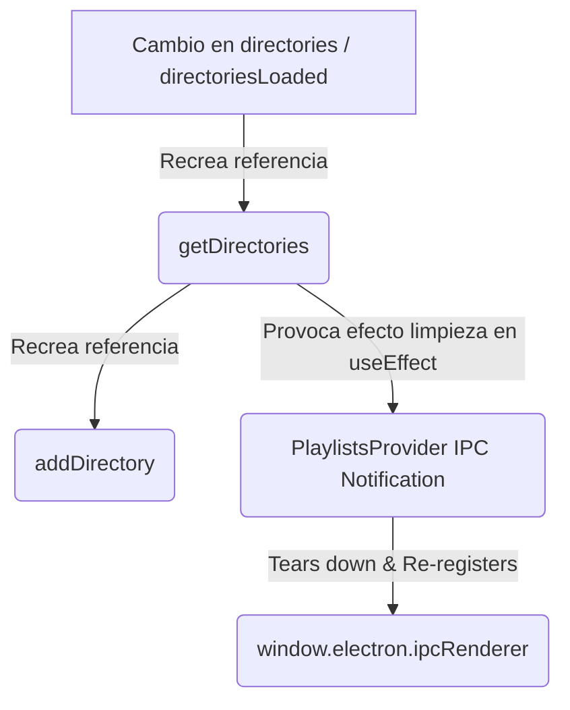

# Reporte de Rendimiento: Análisis de `MiniContext` y `PlaylistsContext`

Este reporte presenta un análisis técnico profundo sobre el comportamiento de renderizado, caídas de rendimiento, riesgos arquitectónicos y propuestas de optimización para dos contextos neurálgicos de la aplicación Elevate:
1. `src/renderer/src/Contexts/MiniContext.jsx` (consumido vía `useMini`)
2. `src/renderer/src/Contexts/PlaylistsContex.jsx` (consumido vía `usePlaylists`)

---

## 📊 1. Resumen Ejecutivo

La arquitectura actual de React Context en Elevate presenta **problemas críticos de acoplamiento y propagación de estados**. Debido a que React propaga re-renders a todos los consumidores de un contexto cuando cualquier parte de su valor cambia, la mezcla de flujos de datos de alta frecuencia (como el progreso del escáner de archivos) con flujos estáticos (como configuraciones o metadatos de playlists) provoca una **degradación de rendimiento en cascada en toda la aplicación**.

### Hallazgos Principales:
* **Efecto Cascada en Escaneo**: Durante el escaneo de directorios, la interfaz de usuario se inunda de eventos IPC de progreso (`scanProgress`). Esto actualiza `MiniContext` decenas de veces por segundo, obligando a re-renderizar prácticamente toda la aplicación (incluyendo la vista de Playlists, Reproductor, Cola e Historial) de forma ininterrumpida.
* **Polución de Dominios y Dependencias Cruzadas**: `PlaylistsProvider` está acoplado con `useQueue` y `useMini`. Cambios en la canción actual o actualizaciones menores en el estado de directorios obligan a recrear los valores del contexto de playlists, forzando re-renders en componentes que solo necesitan interactuar con listas guardadas.
* **Código Muerto y Bucles de Renderizado**: Se identificaron estados huérfanos (`arrayAlbums` y `arrayCovers`) que consumen memoria y generan ciclos de **doble renderizado innecesarios** al actualizar las playlists.

---

## 🔄 2. Arquitectura de Contextos y Cascada de Re-renders

El siguiente diagrama visualiza cómo fluyen las actualizaciones de estado en la implementación actual y por qué un evento menor en un contexto desencadena una reacción en cadena que afecta a toda la UI:



---

## 🚨 3. Análisis Detallado de `MiniContext.jsx`

`MiniContext` actúa como un **monolito de estado** que mezcla 5 responsabilidades de negocio diferentes.

### A. La Bomba de Rendimiento: `scanProgress`
El escáner de archivos emite notificaciones de progreso de forma muy rápida y frecuente. En `MiniContext.jsx` (líneas 151-178), este progreso se captura e inyecta en el estado local:
```javascript
setScanProgress({
  dirPath: parsed.dirPath,
  processed: parsed.processed,
  total: parsed.total
})
```
* **Problema**: Dado que `scanProgress` se incluye en el `contextValue` (línea 219) y es un estado reactivo del `MiniProvider`, cada incremento (por ejemplo, "procesando 120/1200", "121/1200", etc.) recrea el objeto `contextValue`.
* **Impacto**: **Todos** los componentes que llamen a `useMini()` se re-renderizan en cada tick de progreso del escáner, aunque no muestren ninguna barra de progreso (ej. la barra lateral, el historial, el feed, etc.). Esto colapsa el hilo principal (UI thread) de Electron y provoca micro-stuttering o congelamiento visual del reproductor de música.

### B. Dependencia Inestable y Recreación de `getDirectories`
La función `getDirectories` está definida con dependencias inestables (línea 113):
```javascript
const getDirectories = useCallback(async ({ force = false } = {}) => {
  if (!force && directoriesLoaded) {
    return directories
  }
  // ...
}, [directories, directoriesLoaded])
```
* **Problema**: Dado que depende de `directories` y `directoriesLoaded`, cada vez que los directorios terminan de cargarse, se añaden o se eliminan, **la referencia de la función `getDirectories` cambia**.
* **Efecto Dominó**: 
  1. `addDirectory` se vuelve a crear porque depende de `getDirectories` (línea 142).
  2. El `contextValue` cambia completamente de referencia.
  3. En `PlaylistsContex.jsx` (líneas 501-534), el `useEffect` que gestiona notificaciones IPC tiene a `getDirectories` como dependencia. Al cambiar su referencia, **el listener de IPC se destruye y se vuelve a crear**, lo que introduce overhead y riesgo de fugas de memoria o condiciones de carrera durante escaneos masivos.



---

## 🚨 4. Análisis Detallado de `PlaylistsContex.jsx`

El contexto de playlists sufre de sobre-responsabilidad y dependencias inestables que destruyen la memoización del `contextValue`.

### A. Polución de Dominios: Dependencia de `useQueue` y `currentCover`
`PlaylistsProvider` consume directamente la cola de reproducción y calcula el cover de la canción actual en pantalla (líneas 19-20):
```javascript
const { currentFile, removeTrack, addSong } = useQueue()
const currentCover = useSongCover(currentFile?.filePath, 'full')
```
* **Problema**: `currentCover` se añade como dependencia directa en el `useMemo` del `contextValue` (línea 580) y se expone a los consumidores (línea 559).
* **Impacto**: Cada vez que cambia la canción activa (o incluso si hay micro-actualizaciones del estado de la cola que modifiquen la referencia de `currentFile`), `currentCover` se recalcula y cambia el valor del contexto de playlists. **Esto obliga a re-renderizar todas las listas, modales de guardar playlist y menús de añadir canción**, un flujo completamente ajeno al reproductor activo.

### B. Código Muerto y Bucles de Doble Renderizado
El proveedor define dos estados que no son expuestos en el contexto y que no tienen consumidores de lectura en el código de la UI:
```javascript
const [, setArrayCovers] = useState([])
const [, setArrayAlbums] = useState([])
```
A pesar de ser código muerto, se ejecuta un efecto reactivo cada vez que cambia la lista de playlists (líneas 91-93):
```javascript
useEffect(() => {
  updateArrayAlbums(playlists)
}, [playlists, updateArrayAlbums])
```
* **Problema**: `updateArrayAlbums` ejecuta un `setArrayAlbums((currentAlbums) => ...)` que añade elementos concatenados tras resolver URLs de imagen por cada playlist.
* **Impacto de Rendimiento**: Cuando la lista de playlists se carga, la aplicación realiza un renderizado. Inmediatamente después, el `useEffect` se dispara, ejecuta `updateArrayAlbums`, y actualiza el estado local `arrayAlbums`, **provocando un segundo ciclo de renderizado completo e innecesario** de `PlaylistsProvider`. Dado que `arrayAlbums` nunca se lee en ninguna vista, todo este trabajo y la doble fase de renderizado en React son desperdicio de CPU y memoria.

### C. Mezcla de Paginación Pesada (`allSongs`) con Playlists
El contexto gestiona la paginación y carga de la biblioteca completa de música (`allSongs`, `allSongsLoading`, `allSongsPage` de las líneas 131-206).
* **Problema**: La biblioteca completa de canciones y las playlists son dominios que deberían estar separados. Mezclarlos hace que la navegación paginada (hacer scroll infinito en "Todas las Canciones" y cargar páginas consecutivas de 100 canciones) dispare actualizaciones de estado en el proveedor de playlists, forzando renders continuos en componentes que solo necesitan ver las listas de reproducción guardadas del usuario.

---

## ⚠️ 5. Matriz de Riesgos de Rendimiento

A continuación se detallan los riesgos identificados, clasificados por su impacto técnico en la aplicación:

| Componente afectado | Tipo de Riesgo | Impacto | Efecto en la Experiencia de Usuario |
| :--- | :--- | :--- | :--- |
| **Toda la UI de Elevate** | Re-renders de alta frecuencia por `scanProgress` | **CRÍTICO** | Caída severa de FPS (micro-congelamiento) durante el escaneo de carpetas de música. La interfaz responde con retraso al click o arrastre. |
| **Reproductor e IPC** | Churn (alta rotación) de listeners IPC en `useEffect` | **ALTO** | Riesgo de race conditions en las notificaciones del backend. Si el canal IPC se satura con bajas y altas de listeners, se pueden perder eventos de escaneo completado. |
| **Vistas de Playlists y Modales** | Doble Renderizado por Estado Muerto (`arrayAlbums`) | **MEDIO** | Latencia innecesaria al abrir o cargar playlists creadas por el usuario. Desperdicio de CPU en hilos del renderer. |
| **Sidebar / Controles Globales** | Re-render del reproductor acoplado a Playlists (`currentCover`) | **MEDIO** | Cada cambio de canción fuerza a que las sidebars y vistas estáticas de playlists se vuelvan a calcular. |
| **Consumo de Memoria** | Paginación masiva en Contexto Global | **BAJO** | Elevado uso de Heap de JavaScript al propagar y retener arrays muy grandes (`allSongs`) en un contexto con múltiples consumidores vivos simultáneamente. |

---

## 🛠️ 6. Plan de Acción y Propuestas de Mejora

Para solucionar estos cuellos de botella de manera elegante y limpia, se recomiendan los siguientes patrones de refactorización:

### 1. Separación de Contextos (Context Splitting Pattern)

En lugar de mantener un único monolito `MiniProvider`, debemos dividir la funcionalidad en contextos especializados con menor frecuencia de actualización. 

#### Paso A: Separar el Escáner (`LibraryScannerContext`)
Creamos un proveedor exclusivo para el progreso de escaneo y el manejo de directorios:

```jsx
// src/renderer/src/Contexts/LibraryScannerContext.jsx
import { createContext, useContext, useState, useEffect } from 'react'

const LibraryScannerContext = createContext()

export const LibraryScannerProvider = ({ children }) => {
  const [scanProgress, setScanProgress] = useState(null)
  const [directoriesLoading, setDirectoriesLoading] = useState(false)

  useEffect(() => {
    const handleProgress = (message) => {
      // Manejar progreso aquí de forma aislada
    }
    window.electron.ipcRenderer.on('notification', handleProgress)
    return () => window.electron.ipcRenderer.off('notification', handleProgress)
  }, [])

  return (
    <LibraryScannerContext.Provider value={{ scanProgress, directoriesLoading }}>
      {children}
    </LibraryScannerContext.Provider>
  )
}

export const useLibraryScanner = () => useContext(LibraryScannerContext)
```
> [!TIP]
> Al realizar esta división, los componentes comunes de navegación e historial ya no se re-renderizarán cuando el escáner esté enviando datos de progreso. Solo el componente visual del progreso del escáner (ej. barra de progreso en la UI) consumirá `useLibraryScanner` y sufrirá re-renders intencionados.

---

### 2. Estabilización de `getDirectories` con Referencias Estables

Para evitar que `getDirectories` cambie su identidad de función cada vez que cambien los directorios, podemos usar un **React Ref** para almacenar el estado actual de los directorios sin listarlo en las dependencias de `useCallback`:

```javascript
// Dentro de MiniProvider
const directoriesRef = useRef([])
const directoriesLoadedRef = useRef(false)

// Mantener la referencia actualizada silenciosamente
useEffect(() => {
  directoriesRef.current = directories
  directoriesLoadedRef.current = directoriesLoaded
}, [directories, directoriesLoaded])

const getDirectories = useCallback(async ({ force = false } = {}) => {
  // Leemos desde los refs, lo que hace que esta función tenga dependencia estable []
  if (!force && directoriesLoadedRef.current) {
    return directoriesRef.current
  }
  
  setDirectoriesLoading(true)
  // ... lógica de llamada
}, []) // Dependencias vacías: getDirectories tiene una referencia 100% estable
```
> [!IMPORTANT]
> Esto previene por completo la destrucción y recreación constante del listener IPC en `PlaylistsContex.jsx` (línea 529), eliminando el churn de suscripciones del sistema.

---

### 3. Eliminación de Código Muerto en `PlaylistsContex.jsx`

Debemos eliminar los estados no leídos y sus cálculos reactivos para quitar de inmediato el doble renderizado en cada carga de playlists.

#### Código a Eliminar:
```diff
- const [, setArrayCovers] = useState([])
- const [, setArrayAlbums] = useState([])

- const updateArrayCovers = useCallback((someArray) => { ... }, [getCollectionCoverUrl])
- const updateArrayAlbums = useCallback((someArray) => { ... }, [getCollectionCoverUrl])

- useEffect(() => {
-   updateArrayAlbums(playlists)
- }, [playlists, updateArrayAlbums])
```

Esto simplifica el archivo en más de 60 líneas de código inútil y mejora la legibilidad para futuros desarrolladores.

---

### 4. Desacoplamiento de `currentCover`

La variable `currentCover` pertenece al flujo de reproducción de audio actual (Player/Queue) y no al catálogo de playlists.

* **Solución**: Remover `currentCover` de `PlaylistsContex.jsx`.
* **Implementación**: Las páginas que necesiten pintar el cover gigante en el reproductor (como `Music.jsx` o `CurrentPlaying.jsx`) deben consumir directamente `useSongCover(currentFile?.filePath, 'full')` o importarlo desde un nuevo `PlayerContext` en lugar de acoplarse a `usePlaylists`. Esto rompe la dependencia que forzaba a re-renderizar todas las listas guardadas cuando cambiaba la pista en reproducción.

---

### 5. Extra: Implementar un Patrón de Publicación-Suscripción (Pub/Sub) para el Escáner

Si se desea llevar la optimización al máximo nivel para bibliotecas musicales inmensas (más de 10,000 archivos), podemos evitar completamente que React gestione el estado del progreso del escáner en ticks de milisegundos.

En su lugar, creamos un emisor de eventos simple:

```javascript
// src/renderer/src/utils/scanEmitter.js
import mitt from 'mitt' // O un emisor de eventos simple de JS
export const scanEmitter = mitt()

// En el listener IPC global (fuera de los componentes de React):
window.electron.ipcRenderer.on('notification', (message) => {
  try {
    const parsed = JSON.parse(message)
    if (parsed?.type === 'scan-progress') {
      scanEmitter.emit('progress', parsed)
    }
  } catch {
    // ignorar
  }
})
```

Y en el componente visual que muestra el porcentaje en pantalla, nos suscribimos al montar y nos desuscribimos al desmontar:

```jsx
// src/renderer/src/components/ScanProgressBar.jsx
import { useEffect, useState } from 'react'
import { scanEmitter } from '../utils/scanEmitter'

export const ScanProgressBar = () => {
  const [progress, setProgress] = useState(null)

  useEffect(() => {
    const handleProgress = (data) => setProgress(data)
    scanEmitter.on('progress', handleProgress)
    return () => scanEmitter.off('progress', handleProgress)
  }, [])

  if (!progress) return null

  return <div>Progreso: {progress.processed} de {progress.total}</div>
}
```
**Ventaja**: Ningún contexto de React cambia durante el escaneo. La actualización de estado es puramente local a la barra de progreso. La UI se mantendrá a **60 FPS constantes** sin importar la velocidad de procesamiento de archivos en el backend de Electron.
