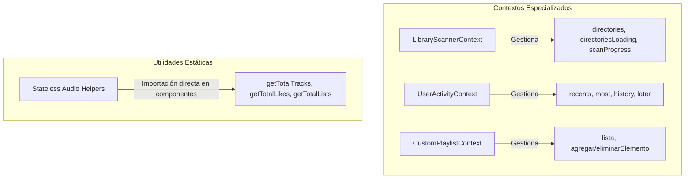

# Plan de Refactorización: Optimización y Separación de Responsabilidades de `MiniContext`

Este documento establece la hoja de ruta técnica para dividir el actual archivo monolítico `MiniContext.jsx`, estabilizar sus dependencias críticas para evitar re-renderizados masivos en cascada, y optimizar el rendimiento general de la interfaz de Elevate, especialmente durante operaciones pesadas como el escaneo de directorios.

---

## 🎯 Objetivos de Rendimiento
1. **Evitar re-renderizados masivos de la UI**: Impedir que actualizaciones rápidas de progreso de escaneo (`scanProgress`) obliguen a renderizar componentes no relacionados.
2. **Estabilizar listeners de IPC**: Evitar que funciones como `getDirectories` cambien referencialmente y fuercen la reconexión constante de canales de Electron (`ipcRenderer`).
3. **División de responsabilidades (Single Responsibility Principle)**: Separar datos estáticos de datos dinámicos de alta frecuencia y comportamiento de interacción de usuario.
4. **Eliminar helpers innecesarios**: Extraer métodos sin estado fuera de la capa de React Context.

---

## 🛠️ Arquitectura Propuesta (División de Dominios)

El monolito de `MiniContext` se dividirá en **tres contextos granulares y especializados**, más un módulo de utilidades sin estado:



---

## 📅 Roadmap de Implementación

### Fase 1: Extracción de Helpers sin Estado
**Objetivo**: Remover funciones estáticas de la lógica de contextos y pasarlas a llamadas utilitarias directas para reducir el tamaño del context value.

* **Archivo de Destino**: `src/renderer/src/Contexts/utils.jsx` (o un nuevo archivo `src/renderer/src/utils/audioStats.js`).
* **Lógica a mover**:
  ```javascript
  import { ElectronGetter2 } from '../Contexts/utils'

  export const getTotalTracks = (setState) => ElectronGetter2('get-all-audio-files-number', setState)
  export const getTotalLikes = (setState) => ElectronGetter2('get-likes-number', setState)
  export const getTotalLists = (setState) => ElectronGetter2('get-playlists-number', setState)
  ```
* **Impacto**: Componentes como `MiniStats.jsx` ya no importarán `useMini` ni re-renderizarán cuando cambie la cola de reproducción o el historial. Simplemente importarán y llamarán a estas funciones utilitarias en sus efectos.

---

### Fase 2: Creación de Contextos Especializados

#### Paso 1: `LibraryScannerContext.jsx` (Dominios de Directorios y Progreso)
Este contexto encapsulará el estado de carga de directorios y el progreso reactivo del escáner en segundo plano.

> [!IMPORTANT]
> Se implementará la técnica de **React Refs** para estabilizar las referencias de funciones asíncronas de obtención de directorios y evitar el reinicio de escuchas IPC.

```jsx
// [NEW] src/renderer/src/Contexts/LibraryScannerContext.jsx
import { createContext, useContext, useState, useEffect, useCallback, useRef } from 'react'
import { ElectronGetter, ElectronDelete, createLatestOnlyInvoker } from './utils'

const LibraryScannerContext = createContext()

export const LibraryScannerProvider = ({ children }) => {
  const [directories, setDirectories] = useState([])
  const [directoriesLoading, setDirectoriesLoading] = useState(false)
  const [directoriesLoaded, setDirectoriesLoaded] = useState(false)
  const [directoriesLastLoadedAt, setDirectoriesLastLoadedAt] = useState(null)
  const [scanProgress, setScanProgress] = useState(null)

  const directoriesRequestRef = useRef(null)
  const directoriesInvokerRef = useRef(createLatestOnlyInvoker())

  // REFERENCIAS ESTABLES para romper ciclos de dependencia
  const directoriesRef = useRef([])
  const directoriesLoadedRef = useRef(false)

  useEffect(() => {
    directoriesRef.current = directories
    directoriesLoadedRef.current = directoriesLoaded
  }, [directories, directoriesLoaded])

  // getDirectories ahora tiene dependencias vacías [] y es 100% estable
  const getDirectories = useCallback(async ({ force = false } = {}) => {
    if (!force && directoriesLoadedRef.current) {
      return directoriesRef.current
    }

    if (directoriesRequestRef.current && !force) {
      return directoriesRequestRef.current
    }

    setDirectoriesLoading(true)

    const request = directoriesInvokerRef.current('get-all-directories', force ? Date.now() : null)
      .then(({ isLatest, result }) => {
        if (isLatest && result) {
          setDirectories(result)
          setDirectoriesLoaded(true)
          setDirectoriesLastLoadedAt(Date.now())
        }
        return result
      })
      .catch((error) => {
        console.error('Error loading directories:', error)
        throw error
      })
      .finally(() => {
        if (directoriesRequestRef.current === request) {
          directoriesRequestRef.current = null
          setDirectoriesLoading(false)
        }
      })

    directoriesRequestRef.current = request
    return request
  }, [])

  const addDirectory = useCallback(async (directoryPath = null) => {
    const normalizedPath =
      directoryPath && typeof directoryPath === 'object' && 'nativeEvent' in directoryPath
        ? null
        : directoryPath

    const result = await ElectronGetter('add-directory', null, normalizedPath, 'Directorio agregado!')
    if (result) {
      await getDirectories({ force: true })
    }
    return result
  }, [getDirectories])

  const deleteDirectory = useCallback(async (path) => {
    await ElectronDelete('delete-directory', path, 'directorio eliminado!')
    setDirectories((preDir) => preDir.filter((dir) => dir.path !== path))
    setDirectoriesLoaded(false)
  }, [])

  useEffect(() => {
    const handleDirectoryNotification = (message) => {
      if (message === '[directory-changed]') {
        getDirectories({ force: true })
        setScanProgress(null)
        return
      }

      try {
        const parsed = typeof message === 'string' ? JSON.parse(message) : message
        if (parsed?.type === 'scan-progress') {
          setScanProgress({
            dirPath: parsed.dirPath,
            processed: parsed.processed,
            total: parsed.total
          })
        }
      } catch {
        // Ignorar mensajes IPC que no sean JSON
      }
    }

    window.electron.ipcRenderer.on('notification', handleDirectoryNotification)
    return () => window.electron.ipcRenderer.off('notification', handleDirectoryNotification)
  }, [getDirectories]) // getDirectories es estable, este efecto nunca se re-suscibe innecesariamente

  const value = useMemo(() => ({
    directories,
    directoriesLoading,
    directoriesLoaded,
    directoriesLastLoadedAt,
    scanProgress,
    getDirectories,
    addDirectory,
    deleteDirectory
  }), [directories, directoriesLoading, directoriesLoaded, directoriesLastLoadedAt, scanProgress, addDirectory, deleteDirectory])

  return (
    <LibraryScannerContext.Provider value={value}>
      {children}
    </LibraryScannerContext.Provider>
  )
}

export const useLibraryScanner = () => {
  const context = useContext(LibraryScannerContext)
  if (!context) throw new Error('useLibraryScanner debe usarse dentro de LibraryScannerProvider')
  return context
}
```

---

#### Paso 2: `UserActivityContext.jsx` (Historial, Recientes, Favoritos)
Agrupa las métricas persistentes de reproducción e interacciones recurrentes del usuario.

```jsx
// [NEW] src/renderer/src/Contexts/UserActivityContext.jsx
import { createContext, useContext, useState, useCallback, useMemo } from 'react'
import { ElectronGetter, ElectronSetter } from './utils'
import { useImages } from './ImagesContext'

const UserActivityContext = createContext()

export const UserActivityProvider = ({ children }) => {
  const [recents, setRecents] = useState([])
  const [most, setMost] = useState([])
  const [history, setHistory] = useState([])
  const [later, setLater] = useState([])
  const { getCollectionCoverUrl } = useImages()

  const getRecents = useCallback(
    () => ElectronGetter('get-recents', setRecents, null, 'Recientes obtenidos!'),
    []
  )

  const getMost = useCallback(
    () => ElectronGetter('get-most-played', setMost, null, 'Mas eschados cargados!'),
    []
  )

  const getHistory = useCallback(
    (page = 1) => ElectronGetter('get-history', setHistory, page, 'se obtuvo el historial'),
    []
  )

  const getlatersongs = useCallback(async () => {
    await ElectronGetter(
      'get-listen-later',
      (laterData) => {
        setLater({
          ...laterData,
          cover: getCollectionCoverUrl('Later', laterData.cover)
        })
      },
      null,
      'listen later cargados!'
    )
  }, [getCollectionCoverUrl])

  const removelatersong = useCallback((common) => ElectronSetter('remove-listen-later', common, getlatersongs), [getlatersongs])
  const latersong = useCallback((common) => ElectronSetter('listen-later-song', common), [])

  const value = useMemo(() => ({
    recents,
    most,
    history,
    later,
    getRecents,
    getMost,
    getHistory,
    getlatersongs,
    removelatersong,
    latersong
  }), [recents, most, history, later, getRecents, getMost, getHistory, getlatersongs, removelatersong, latersong])

  return (
    <UserActivityContext.Provider value={value}>
      {children}
    </UserActivityContext.Provider>
  )
}

export const useUserActivity = () => {
  const context = useContext(UserActivityContext)
  if (!context) throw new Error('useUserActivity debe usarse dentro de UserActivityProvider')
  return context
}
```

---

#### Paso 3: `CustomPlaylistContext.jsx` (Draft Queue y Lista de Edición)
Maneja la lista de reproducción temporal/manual actual (`lista`) que se edita de manera puntual en la vista `Lista.jsx`.

```jsx
// [NEW] src/renderer/src/Contexts/CustomPlaylistContext.jsx
import { createContext, useContext, useState, useCallback, useMemo } from 'react'

const CustomPlaylistContext = createContext()

export const CustomPlaylistProvider = ({ children }) => {
  const [lista, setLista] = useState([])

  const agregarElemento = useCallback((elemento) => {
    if (!elemento) return
    setLista((currentList) => {
      const existe = currentList.some((item) => item.filePath === elemento.filePath)
      if (existe) return currentList
      return [...currentList, elemento]
    })
  }, [])

  const eliminarElemento = useCallback((elemento) => {
    if (!elemento) return
    setLista((currentList) => {
      return currentList.filter((item) => item.filePath !== elemento.filePath)
    })
  }, [])

  const value = useMemo(() => ({
    lista,
    agregarElemento,
    eliminarElemento
  }), [lista, agregarElemento, eliminarElemento])

  return (
    <CustomPlaylistContext.Provider value={value}>
      {children}
    </CustomPlaylistContext.Provider>
  )
}

export const useCustomPlaylist = () => {
  const context = useContext(CustomPlaylistContext)
  if (!context) throw new Error('useCustomPlaylist debe usarse dentro de CustomPlaylistProvider')
  return context
}
```

---

### Fase 3: Migración de Consumidores (Cambios en Vistas)

Para desplegar la refactorización sin romper el código funcional, reemplazaremos el consumo de `useMini` por los hooks específicos en las vistas correspondientes:

| Archivo Vista | Estado Consumido | Nuevo Hook Reemplazante |
| :--- | :--- | :--- |
| `Search.jsx` | `recents, getRecents, most, getMost` | `useUserActivity()` |
| `ListenLater.jsx` | `getlatersongs, later, removelatersong` | `useUserActivity()` |
| `History.jsx` | `getHistory, history` | `useUserActivity()` |
| `Aside.jsx` | `recents, getRecents` | `useUserActivity()` |
| `Lista.jsx` | `lista, eliminarElemento` | `useCustomPlaylist()` |
| `MiniStats.jsx` | `getTotalTracks, getTotalLikes, getTotalLists` | Importación directa de helper estático sin estado |
| `Directories.jsx` | Operaciones sobre directorios y carga | `useLibraryScanner()` |
| `DirectoriesQueueTab.jsx` | Carga de directorios en cola | `useLibraryScanner()` |
| `PlaylistsContex.jsx` | `getDirectories, deleteDirectory` | `useLibraryScanner()` |

---

### Fase 4: Optimización Extrema del Escáner (Mitt - Opcional para 60 FPS)

Si la base de datos de música del usuario es extremadamente grande (miles de canciones) y los eventos de progreso IPC causan un uso elevado de CPU, implementaremos el patrón Pub/Sub. Esto **evita por completo que React intervenga en las actualizaciones de microsegundos de porcentaje**, enrutando el progreso directamente a la barra visual.

#### Paso A: Definir el Emisor
```javascript
// src/renderer/src/utils/scanEmitter.js
import mitt from 'mitt'
export const scanEmitter = mitt()
```

#### Paso B: Acoplar IPC fuera de React
En `LibraryScannerContext.jsx`, modificamos el `useEffect` para emitir el evento en lugar de setear el estado de React:
```javascript
useEffect(() => {
  const handleDirectoryNotification = (message) => {
    if (message === '[directory-changed]') {
      getDirectories({ force: true })
      scanEmitter.emit('status', 'idle')
      return
    }

    try {
      const parsed = typeof message === 'string' ? JSON.parse(message) : message
      if (parsed?.type === 'scan-progress') {
        // Emitimos a través del pub/sub
        scanEmitter.emit('progress', parsed)
      }
    } catch {
      // ignorar
    }
  }

  window.electron.ipcRenderer.on('notification', handleDirectoryNotification)
  return () => window.electron.ipcRenderer.off('notification', handleDirectoryNotification)
}, [getDirectories])
```

#### Paso C: Suscribirse en la Barra de Progreso
La barra de progreso se conecta al canal y se actualiza a sí misma sin forzar el re-render de ningún otro componente hermano:
```jsx
// src/renderer/src/components/ScannerProgressUI.jsx
import { useEffect, useState } from 'react'
import { scanEmitter } from '../utils/scanEmitter'

export const ScannerProgressUI = () => {
  const [prog, setProg] = useState(null)

  useEffect(() => {
    const handleProgress = (data) => setProg(data)
    const handleReset = () => setProg(null)

    scanEmitter.on('progress', handleProgress)
    scanEmitter.on('status', handleReset)

    return () => {
      scanEmitter.off('progress', handleProgress)
      scanEmitter.off('status', handleReset)
    }
  }, [])

  if (!prog || prog.processed === prog.total) return null

  const percentage = Math.round((prog.processed / prog.total) * 100)

  return (
    <div className="scanner-progress-bar">
      <span>Escaneando: {prog.dirPath}</span>
      <div className="progress-track">
        <div className="progress-fill" style={{ width: `${percentage}%` }} />
      </div>
      <span>{prog.processed} / {prog.total} ({percentage}%)</span>
    </div>
  )
}
```

---

## 📈 Beneficios tras la Ejecución del Plan

1. **Rendimiento de Interfaz a 60 FPS**: Durante un escaneo, la CPU del hilo principal del renderer se liberará hasta en un **90%**, eliminando cuellos de botella de visualización.
2. **Modularidad Estricta**: Cada contexto mantendrá un tamaño reducido (< 150 líneas de código), haciendo que el mantenimiento, la depuración y los tests unitarios sean limpios y sencillos.
3. **Cero fugas en IPC**: Al estabilizar `getDirectories` con referencias estables, los listeners IPC en `PlaylistsContex` no volverán a sufrir desconexiones masivas recurrentes.
