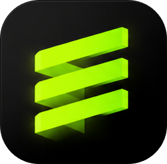

# Elevate

<p align="center">
  
</p>

<p align="center">
  <strong>A fast, local-first desktop music player for people who still love owning their music library.</strong>
</p>

<p align="center">
  Elevate brings together local playback, playlists, listening history, library statistics, reactive visualizers, and a polished desktop experience built for Windows.
</p>

<p align="center">
  <a href="https://reactjs.org/"></a>
  <a href="https://www.electronjs.org/"></a>
  <a href="https://vite.dev/"></a>
  <a href="https://www.prisma.io/"></a>
  <a href="https://www.sqlite.org/"></a>
  <a href="https://nodejs.org/"></a>
  <a href="https://sass-lang.com/"></a>
  <a href="https://www.npmjs.com/"></a>
</p>

---

## What Is Elevate?

Elevate is an offline desktop music player for local libraries. It is designed for quick navigation, reliable playback, rich library context, and a visual music experience that feels alive without needing a streaming service.

Use Elevate when you want to:

- Play local audio files from your own folders.
- Build playlists from your library.
- Browse directories, liked songs, listening history, and statistics.
- Open an immersive music view with cover mode and Butterchurn visualizations.
- Keep playback stable even when covers, rankings, or secondary data fail to load.

The Windows packaged app uses the app icon in [`docs/assets/elevate.ico`](docs/assets/elevate.ico), copied from the build icon used by Electron Builder.

## Features

- **Local music playback** with queue, shuffle, repeat, volume, mute, likes, and Picture-in-Picture controls.
- **Immersive music screen** with album-cover mode, background cover mode, and reactive Butterchurn visualizer presets.
- **Playlists and directories** for organizing imported local music folders.
- **Listening history** with per-song timelines and playback activity.
- **Library statistics** including short views, long views, repeats, skips, and active listening time.
- **Collection insights** for playlists, directories, rankings, and all-library views.
- **Cover caching** with memory-conscious thumbnail and full-cover handling.
- **Large-library performance** through virtualized lists and lazy data loading.

## Installation For Users

The easiest way to install Elevate is to use a packaged Windows release.

1. Open the [Elevate releases page](https://github.com/TylorDev/Elevate/releases).
2. Download the latest Windows setup file, usually named like `Elevate-<version>-setup.exe`.
3. Run the installer.
4. Launch Elevate from the desktop shortcut or Start menu.
5. Import your music folders and start listening.

Packaged Windows installs keep mutable user data outside the install directory:

| Data | Location |
| --- | --- |
| App install | `%LOCALAPPDATA%\Programs\Elevate\` |
| User data | `%APPDATA%\Elevate\` |
| Local database | `%APPDATA%\Elevate\elevate.db` |
| Cover cache | `%APPDATA%\Elevate\covers\` |

To reset the packaged app, remove the contents of `%APPDATA%\Elevate\`. Uninstalling the app alone does not remove your user data.

## First Launch

On first launch, Elevate creates its local database and app data folders automatically. After that:

1. Import a folder that contains your local music.
2. Let Elevate scan metadata and covers.
3. Open the queue, playlists, directories, history, or statistics views.
4. Use the immersive music screen when you want cover art or visualizers to take over the session.

If a cover, statistic, or visualizer fails to load, playback should continue. Reliability is a core rule of the app.

## Contributor Setup

### Prerequisites

- [Node.js](https://nodejs.org/) `>=24 <25`
- npm `>=11`
- Git
- Windows is recommended for packaging and installer validation

### Clone And Install

```sh
git clone https://github.com/TylorDev/Elevate.git
cd Elevate
npm install
```

`npm install` also runs Prisma generation and installs Electron app dependencies through the `postinstall` script.

### Environment

Create a local `.env` file in the project root:

```env
DATABASE_URL="file:./prisma/dev.db"
ELECTRON_REMOTE_DEBUGGING_PORT=8315
```

`DATABASE_URL` is required by Prisma. `ELECTRON_REMOTE_DEBUGGING_PORT` is optional, but useful when debugging the Electron renderer.

### Start Development

```sh
npm run dev
```

This starts Electron through the local Electron Vite wrapper.

## Useful Scripts

| Command | Purpose |
| --- | --- |
| `npm run dev` | Start the app in development mode. |
| `npm start` | Preview the built app with Electron Vite. |
| `npm run build` | Clean build output, prepare the template database, and build the app. |
| `npm run build:win` | Build and package the Windows installer. |
| `npm run build:unpack` | Build an unpacked desktop app directory. |
| `npm run electron:rebuild` | Rebuild/install native Electron app dependencies. |
| `npm run lint` | Run ESLint with automatic fixes. |
| `npm run format` | Run Prettier across the repository. |

## Build And Package

For a production build:

```sh
npm run build
```

For a Windows installer:

```sh
npm run build:win
```

The Windows build prepares the Microsoft Visual C++ Redistributable automatically. For offline builds, provide a local redistributable file:

```sh
set VC_REDIST_X64_PATH=C:\path\to\vc_redist.x64.exe
npm run build:win
```

Build output is written to `dist/`.

## Project Structure

```txt
src/
  main/                 Electron main process, storage, IPC, Prisma runtime
  preload/              Safe bridge between Electron and the renderer
  renderer/
    src/
      components/       Player, queue, visualizer, cards, controls, UI pieces
      Contexts/         Audio, playback, queue, images, playlists, settings
      Pages/            Feed, music, history, statistics, playlists, folders
prisma/                 SQLite schema, migrations, development/template DBs
resources/Elevate/      Butterchurn visualizer presets
docs/                   Project documentation and README assets
```

For deeper architecture notes, IPC contracts, cache rules, and contribution constraints, read [`docs/technical-overview.md`](docs/technical-overview.md).

## Troubleshooting

### `npm install` fails on native modules

Make sure you are using Node.js `>=24 <25`, then run:

```sh
npm run electron:rebuild
```

### Prisma cannot find the database URL

Confirm `.env` exists and contains:

```env
DATABASE_URL="file:./prisma/dev.db"
```

### The packaged app opens with old data

Packaged app data lives in `%APPDATA%\Elevate\`. Remove that folder's contents to reset the app to a fresh state.

### Windows packaging cannot download the Visual C++ Redistributable

Download `vc_redist.x64.exe` manually, then set:

```sh
set VC_REDIST_X64_PATH=C:\path\to\vc_redist.x64.exe
npm run build:win
```

## Contributing

Before opening a pull request:

- Keep playback resilient. Secondary failures should not stop audio.
- Preserve IPC channel names unless a migration is planned.
- Use lazy loading for expensive data.
- Keep large lists virtualized.
- Clean up IPC listeners, animation frames, observers, and object URLs.
- Preserve or improve accessibility labels and keyboard behavior.
- Validate the change with the most relevant script or manual playback flow.

Recommended commit style:

```txt
feat(music): add visualizer preset controls
fix(images): revoke object urls when pruning cache
perf(queue): avoid loading inactive tabs
refactor(feed): cache rankings by scope
test(history): cover paginated history dedupe
```

## Documentation

- [`docs/technical-overview.md`](docs/technical-overview.md): architecture, IPC contracts, data models, performance notes, and testing guidance.
- [`docs/installation-storage.md`](docs/installation-storage.md): where Elevate stores user data in development and packaged Windows installs.
- [`docs/windows-native-bindings.md`](docs/windows-native-bindings.md): Windows native dependency notes.

## Maintainer Note

Elevate should feel fast, local, and reliable. When choosing between a new feature and playback stability, choose playback stability.
